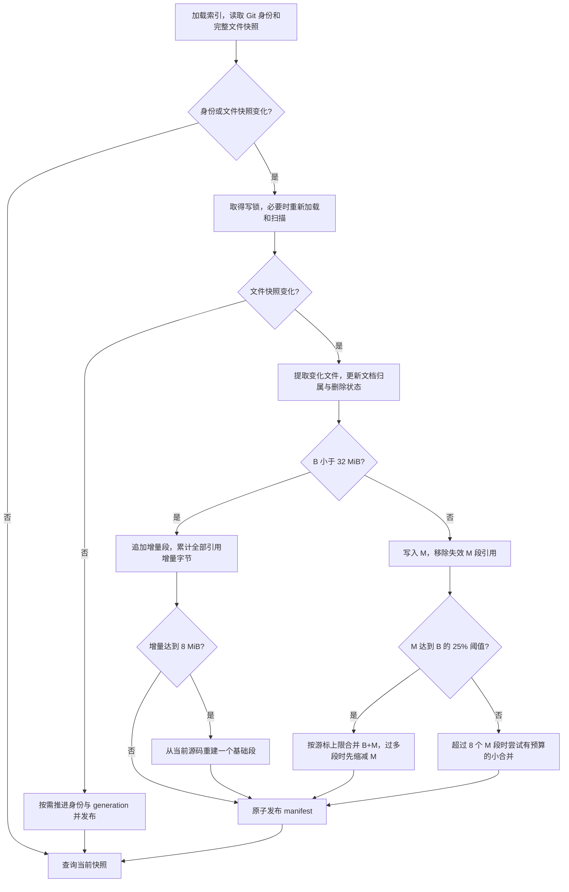

# 按规模选择增量重建或两代合并

2026-09-18 更新：有 HEAD commit 的 Git 工作区改用 [commit 快照与工作区覆盖层](commit-snapshots.md)。
本文保留为原策略说明，继续适用于非 Git 目录及 unborn HEAD；其中 Git 回退策略已被替代。

实现状态：2026-09-10，分支 `feat/generational-index-refresh`，基于 main `0ab2294`。
本文描述最终实现；[三档真实提交 benchmark](../benches/results/size-tiers-2026-09-10.md)
记录同一 release 的验证结果。早期单段和 50% 试验仅作为历史证据。

## 1. 最终策略与分支改动

| 项目 | 当前规则 |
|---|---|
| B 的定义 | manifest 的第一个不可变索引段；大小为 lookup + postings |
| B < 32 MiB | 只为变化文件追加增量段；累计增量达到 8 MiB（含本次新增段）时从当前源码重建 |
| B ≥ 32 MiB | B 为基础代，后续段共同组成 M；没有独立新生代或晋升窗口 |
| 大库 B+M 合并 | M 达到 `max(ceil(B × 25%), 8 MiB)` 时，在内容刷新中合并已有索引 |
| 回退 | 与当前有效文件快照做 diff，使用相同更新规则；不切换 Git tree 缓存 |
| 发布 | 操作系统写锁、不可变段、manifest 原子替换；小库更新使用可重建缓存语义 |
| 显式维护 | `compact` 只读已有索引；不提供 `compact --full` |

32 MiB 按更新前 B 的字节数判断，不按源码、manifest 或 B + M 总量判断；
恰好 32 MiB 时启用分代。重建或合并后的下一次更新使用新 B 大小选择模式。
本分支不改变 gram、查询候选算法、manifest 二进制 schema 或 lookup/postings v4 格式。
二进制 manifest、512 文件以下串行遍历和构建外排预算已在基线实现，不作为本分支新增收益。

## 2. 从完整快照计算变化

[refresh](../src/index.rs) 使用 libgit2 读取 HEAD/tree 身份，并沿现有 ignore
遍历规则收集完整的路径、长度、mtime 快照。`git_state::inspect` 和 Git status
变更路径已移除；变化始终相对于上次索引的有效工作区状态计算，包含未提交文件。

- 身份与文件快照都未变：直接查询，不取得写锁、不写 manifest、不维护旧多段索引。
- 文件快照未变但身份变化：取得写锁，推进 HEAD/tree 和 generation，复用全部段。
- 文件快照变化：取得写锁，只提取变化文件；删除文件标记 inactive。
- 取得写锁后发现其他写者已发布：重新加载并再次收集文件快照；若已刷新完成就复用。
- manifest 未变：复用锁前扫描结果，避免普通更新重复遍历。



回退比较的是 `B ⊕ M` 的完整有效状态：M 的新版本及删除状态覆盖 B，
不能只枚举 M 中出现的文件，也不能用新 HEAD 的 Git status 代替该 diff。
例如上次索引后先提交 X 的修改，再未提交地修改 Y，刷新必须同时更新 X 和 Y。
小库的基础段与累计增量也按同样的版本归属规则工作。

同一文件从 B 的 v1 更新到增量中的 v3，再回退到 v2，会重新索引 v2；
回退到 v1 也重新索引，不额外读取 B 来验证内容是否可复用。删除不会重新暴露 B 的旧版本。
现有文件修改复用文档 ID；新增文件追加 ID；重建会重新编号，合并不会。
文件按整体重新提取 gram，不做行级 posting 更新。

变化检测仍依赖元数据：仅改变 mtime 可能产生额外增量；长度和 mtime 均未变的
内容替换可能无法发现。未实现内容指纹去重、文件监听或常驻服务。

## 3. 小库：累计 8 MiB 后重建

小库保留旧版的增量追加方式，但用字节阈值替代“已有 8 段”及“至少 64 个文件且
超过 20% 文件变化”的重建条件。64 个文件变化或段数超过 8，本身都不会触发重建。

累计量为 manifest 中除 B 外所有引用段的 lookup/postings 之和，包括段内旧版本
及已完全失效但仍被引用的增量段。B、manifest、未被引用的旧文件和构建临时文件不计入。
小库不自动清理增量段引用，也不自动做 M 内合并；仅有删除时可只写 manifest。

本次增量编码完成后检查阈值，达到 8 MiB 就在同一写锁下从当前源码重建一个 B，
最终发布的增量为空，中间增量快照不对查询可见。全量重建继续遵守构建工作内存预算。
无内容变化时不重建；旧多段索引也不会在无变化查询时迁移为单段。

这里“恢复旧版”指普通更新只写增量，不恢复 Git tree 缓存、8 段阈值或大改动阈值。
小库没有额外段数上限，本轮 viberwhisper / whisper.cpp 最多出现 77 / 37 个段。

## 4. 大库：两代和流式合并

[compaction](../src/compaction.rs) 保留首段 B，先移除不再拥有有效可搜索文档的
M 段引用，再计算剩余 M 的字节数。段内仍可能包含旧版本；此处衡量物理索引体积，
并非源码 diff 大小。M 内所有段地位相同，小合并的输出仍属于 M。

| 维护规则 | 边界 |
|---|---|
| M 段数软上限 | 8；超出才尝试小合并 |
| 一次 M 小合并 | 2–4 个段，总输入不超过 32 MiB；每段不超过最小输入的 4 倍 |
| 输入选择 | 按大小选较小段，同大小时优先较旧的段；没有合适组合则保留新增量 |
| B+M 阈值 | M 达到 `max(ceil(B × 25%), 8 MiB)`，优先于小合并 |
| 合并游标上限 | 每批最多 32 个输入；旧索引超过上限时本次先合并最多 32 个 M 段 |
| 自动维护次数 | 每次内容刷新最多一次；后续刷新再检查尚未满足的维护条件 |

[段游标](../src/segment.rs) 按 `(gram, doc_id)` 顺序流式读取，过滤 inactive、
不可搜索或已归属其他段的版本，再用小顶堆归并。输出复用现有编码器，不需要读取
未修改源码、重新提取 gram 或物化全部 posting。长 posting 使用有界缓冲。
对输出键计数和编码使用临时分片及键元数据，不假定输入键数之和就是输出键数。

合并 B 后当前有效版本指向新 B；未参加某次合并的更新段仍能覆盖旧版本。
没有分页或压缩字节直拷贝优化，大合并仍需遍历并重写参与合并的索引记录。
32 MiB 输入预算只约束 M 小合并，不限制 B+M 合并的总字节数或单次延迟。

## 5. 查询与更新维护的区别

[DiskIndex::postings](../src/index.rs) 的查询算法保持不变：只在各段查相关键，
过滤无效版本后合并候选文件；随后读取候选文件，用原正则精确匹配。
查询不会为了合并候选而扫描整个索引。物理索引合并则遍历参与段的全部记录并写出新段。

此前“小库每次更新合成一个 B”的试验为查询少读几个段付出了整份索引重写的成本，
普通更新约 19–22 ms，因此最终改为累计增量达到 8 MiB 才重建。
段数增加仍有查询成本，不能用重建后单段的查询数据代表增量峰值时的延迟。

`--no-refresh` 只读已有索引，不检查、刷新或维护文件快照；最终精确匹配仍读取
文件当前内容，因此源码变化时旧索引可能漏掉新候选，已删除候选也可能导致读取错误。

## 6. 写锁、发布与兼容

构建、刷新及实际 compact 共用索引目录下的 `write.lock`，由操作系统释放进程锁。
写者持锁直到发布结束；未变化的查询可继续读取旧不可变段，需要刷新的查询会等待。
原子替换 manifest 保证读者使用一个已发布的索引快照，不等于冻结工作区的后续编辑。

| 写入路径 | 发布语义 |
|---|---|
| 小库增量、8 MiB 重建、仅推进 Git 身份 | 完成缓冲写入后原子替换，不逐文件 `sync_all`；系统崩溃后缓存可能需要重建 |
| 小库重建得到 B ≥ 32 MiB | 发布前同步最终 B 和 manifest，衔接分代更新 |
| 大库更新、显式 index、实际 compact | 同步段文件、manifest；Unix 下同步相关目录 |

段文件使用唯一 ID，在临时目录写完后发布；manifest 使用 `NamedTempFile::persist`
替换。正常完成或返回错误时清理本次构建和编码临时目录；强制退出可能留下临时文件。
旧段不立即删除，以保护持有旧 mmap 的读者。GC、锁外合并及发布时重试尚未实现。

[manifest 编码](manifest-format.md) 的分代基线为 `CDRGMF01`；后续 Git 快照路径使用
带校验和及注册表身份的 `CDRGMF02`，仍兼容读取 v1。段格式仍为 v4。可继续读取
活动旧 JSON 索引，下一次写 manifest 时升级为二进制。历史 `manifests/<tree>.*`
不再写入或使用，已有文件暂留；段文件暂留是延迟回收，不是 Git 回退缓存。

## 7. 命令与统计口径

```sh
coderg stats /path/to/repository
coderg stats /path/to/repository --json
coderg compact /path/to/repository --dry-run --json
coderg compact /path/to/repository
coderg index /path/to/repository
```

`compact` 不扫描源码：小库合并所有当前有效段为一个 B，必要时按 32 个输入分批；
大库只合并最多 32 个 M 段。`--dry-run` 不取得写锁、不改文件，计划可能因并发更新改变。
需要从源码强制重建时使用 `index`，`compact --full` 已移除。

默认 `stats` 的 `base bytes` 为 B，`middle bytes` / `middle segments` 为其余引用段。
`generational` 按 B 是否达到 32 MiB 判断；小库的 automatic base compaction threshold
字段实际上对应 8 MiB 重建阈值。`maintenance due` 是待维护提示，不会驱动无变化查询维护。
大库超 8 段但无合适小合并输入时，该提示也可能为 true。
`index bytes` 只含当前 manifest 和引用段，不是整个目录累计占用。
`stats --json` 导出完整 manifest，不是默认统计摘要的 JSON；`compact --json` 则导出合并摘要，
dry-run 的输出段及输出字节尚未生成。

## 8. 性能与验证

[三档真实提交测试](../benches/results/size-tiers-2026-09-10.md) 各重放 100 次前进，
再各做 4 次回退/再前进；共 1464 项历史输出对照通过，独立查询也逐次核对 rg。
下面仅汇总前进阶段的中位耗时，单位 ms；单次维护按实测值列出。

| 仓库 | 普通增量，无维护 | 触发维护 |
|---|---:|---|
| viberwhisper | 9.76（98 次） | 重建 23.48（1 次）；另有 1 次元数据推进 |
| whisper.cpp | 21.91（97 次） | 重建 204.94（3 次） |
| vLLM | 62.60（55 次） | M 合并 75.74（44 次）；B+M 合并 885.15（1 次） |

小库第 78 次、中库第 25/52/89 次触发重建；大库第 79 次触发 B+M 合并。
同提交普通增量对照、P95、M 大小及查询时 B/M 状态见报告。独立 rg 使用相同隐藏文件范围，
索引放在源码外；逐提交 rg 数据保留，但不以混合调用顺序的值作为统一查询基线。
这三个不同仓库不能证明 32 MiB 是通用最优切换点，也不能从单次大合并推断尾延迟。

74 项 Rust 测试、clippy、格式检查通过。覆盖 8 MiB 边界、本次增量触发重建、
超过 8 段或 64 个文件变化仍不重建、反复修改/回退/删除/恢复/重命名/二进制转换、
HEAD 改变且工作区仍脏、并发只发布一次、合并编码失败保留 manifest、外排字节一致与清理。

## 9. 历史试验与未采用方案

| 记录 | 当前解释 |
|---|---|
| [早期模拟更新](../benches/results/vllm-generational-updates-2026-09-09.md) | 用于初步观察，不能代替真实 commit |
| [500 个真实 vLLM 提交](../benches/results/vllm-real-commits-2026-09-09.md) | 比较 25%/50%；最终选择 25%，归档的 50% 不是当前默认 |
| [同步开销定位](../benches/results/small-sync-profile-2026-09-09.md) | 解释早期小库负收益；最终只对小库更新恢复缓存发布语义 |
| [单段试验](../benches/results/small-single-2026-09-09.md)、[直接合并](../benches/results/small-direct-2026-09-10.md) | 每次重写 B 和无变化时迁移单段均已替代 |
| [8 MiB 重建初测](../benches/results/small-8m-2026-09-10.md) | 与当前实现一致；三档测试补齐中档及大库 B+M 事件 |
| [批量元数据](../benches/results/vllm-bulk-metadata-2026-09-09.md) | 接入后变慢，未保留该原型；仍沿用原目录遍历 |
| [Chromium 剖析](../benches/results/chromium-search-profile-2026-09-09.md) | 当时定位 JSON 加载；二进制 manifest 已在基线落地，源码快照没有 Git 历史 |
