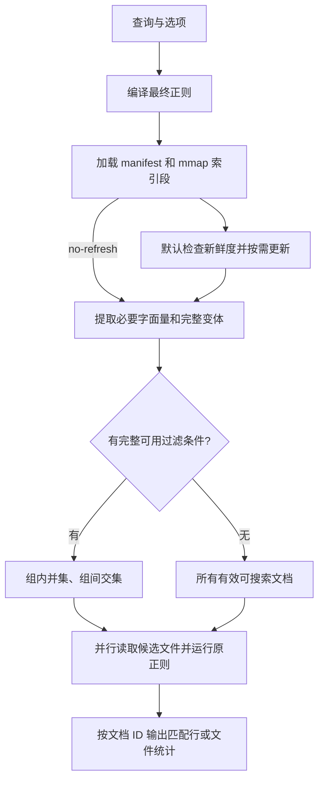

# coderg 已实现的优化与策略

查询覆盖与分支执行的设计、案例和性能取舍见[专项设计文档](query-covering-optimization.md)。

本文按 2026-09-07 的实现整理，并更新了 2026-09-08 的查询覆盖及分支执行优化。当前实现已通过 37 个测试，实验记录见[本轮报告](../benches/results/branch-covering-2026-09-08.md)；历史实验数字应按对应版本解读。源码是行为依据；实验报告用于说明对应版本的测量结果。两字节查询扩展已由用户决定**暂缓采用**，不属于本文的已实现优化。

coderg 的主要收益来自三件事：提前用索引排除不可能匹配的文件；以紧凑格式按需读取索引；文件或 Git 状态变化时尽量复用已有内容索引。最终匹配仍由 Rust `regex` 引擎读取候选文件后完成。

[刷新路径优化](refresh-path-optimization.md)进一步解释批次收集、manifest 解析和小仓库串行遍历的设计、测量与取舍。

## 1. 搜索流程与模块分工



默认搜索在索引加载失败时尝试重新构建；刷新改变索引后重新加载 manifest 和段映射。`--no-refresh` 跳过新鲜度检查，仍需加载索引，且加载失败会直接报错。[search::run](../src/search.rs#L24)

| 模块 | 主要职责 |
|---|---|
| [main.rs](../src/main.rs) | CLI 参数、搜索结果退出码、索引统计输出 |
| [ngram.rs](../src/ngram.rs) | 字节 gram 生成、稀疏选择、哈希及权重缓存 |
| [segment.rs](../src/segment.rs) | 索引段编码、内存映射、按键读取文件 ID 列表 |
| [index.rs](../src/index.rs) | 文件快照、构建/刷新、文档版本、跨段查询及树缓存 |
| [git_state.rs](../src/git_state.rs) | 进程内读取 Git 身份、工作区状态和变更路径 |
| [query.rs](../src/query.rs) | 从正则结构提取安全的索引过滤条件 |
| [search.rs](../src/search.rs) | 预算控制、候选集合运算、最终匹配和输出 |

## 2. 文件收集、编号与并行构建

文件遍历根据上次元数据快照的文件数选择执行方式：不超过 512 个文件时，使用 `ignore::WalkBuilder::build` 在当前线程完成遍历和路径排序；更大的快照和没有历史快照的首次构建使用 `build_parallel`，线程数取自 Rayon 当前线程池。候选文件匹配仍使用 Rayon，因此小仓库的串行遍历不会把匹配也限制为单线程。两条遍历路径共用 ignore 配置，包含隐藏文件，不跟随符号链接，排除 `.git` 和实际选用的索引目录。默认索引目录为 `<root>/.coderg-index`；相对 `--index-dir` 按搜索根目录解析。[collect_files](../src/index.rs)、[resolve_index_dir](../src/index.rs)

每个普通文件记录相对路径、长度和纳秒修改时间。并行路径中，每个遍历 visitor 独立收集结果，退出时只获取一次锁发布整批结果；主线程检查所有批次的错误、按总文件数预分配快照，再使用 Rayon 按路径并行排序。串行路径直接收集结果并传播错误。两条路径都完整遍历、按同一条路径比较规则排序；历史文件数只是性能提示，仓库突然增长超过阈值时也不会提前结束或漏掉新增文件。这个有序快照用于比较工作区变化；全量构建也按它分配 `u32` 文档 ID。增量修改现有文件时复用 ID，新增文件追加 ID，删除文件标记失效；全量重建会重新编号。

文件内容读取及 gram 生成由数量受预算限制的生产线程并行处理，使用 32 KiB 块并保留 23 字节重叠。根据文件前 8 KiB 是否含 NUL 判定二进制文件；二进制文件保留元数据，但 `searchable = false`，不生成 postings，也不进入正常搜索候选。[index_files](../src/index.rs)、[16/32 KiB 对照](../benches/results/chunk-32k-2026-09-08.md)

每块用 `HashSet<u64>` 去重已混合的 gram 哈希，首次插入成功后才压缩为 `u32` 并追加到 `Vec<u32>`，省掉重复 gram 的压缩以及提取结束后遍历集合收集结果的步骤；数组通过有界通道交给收集端。不同 `u64` 哈希压缩后可能成为同一个键，由后续排序或归并去重消除。连续的 `(gram, document_id)` 记录每条 8 字节；排序数组满时原地排序、去重并写临时 run。中间归并每组最多 32 个 run；最终按 gram 范围最多 4 个任务并行归并，直接编码 postings 分片及有界键元数据，再拼接 postings 并按全局每 128 键生成 lookup，省去最终原始有序 run 的写读。默认 `--build-memory-mib 256` 为提取、记录、归并和编码的主要缓冲区分配预算，全量和增量共用；文件元数据、Git 内部状态和分配器开销等不在该预算内，因此不是硬性进程 RSS 限制。索引仍只保存文件集合，不记录位置或次数。[构建预算与验证](index-build-memory-budget.md)、[4 路归并实测](../benches/results/parallel-merge-2026-09-08.md)

## 3. 字节 gram 的生成和选择

### 3.1 所有三字节片段，加较长的稀疏片段

`MIN_GRAM = 3`、`MAX_GRAM = 24`，单位都是**字节**。每个连续三字节片段都会进入索引；长度 4–24 的片段按照内部字节对权重选择一部分。[for_each_sparse_gram](../src/ngram.rs#L68)

对于一个候选长片段，计算相邻两字节的确定性权重。仅当左右端点字节对的权重都严格大于内部字节对权重时，保留该片段。权重来自字节值的哈希混合，没有使用语料中的词频或文档频率。

选择规则只依赖片段内部的字节，因此从查询中选出的 gram，只要确实出现在某个文件中，也会由该文件的同一生成规则产生。这是查询过滤能够复用稀疏 gram 的基础。

### 3.2 长片段优先的多片段覆盖

`covering_hashes` 保留原来最长、同长度时最后出现的 gram 作为第一个键，再增加覆盖字面量其余部分的片段。覆盖选择从左向右贪心延伸，相邻片段至少重叠两字节，使预算充足时每个 trigram 位置都被覆盖；之后按长度优先排序、按哈希去重，并限制返回键数。所有键仍由现有 gram 生成规则产生，权重、索引格式和刷新策略不变。[covering_hashes](../src/ngram.rs)

不足三字节的字面量返回空列表。例如单独的 `if` 或 `\bif\b` 当前没有可用 gram；如果整个正则中另有较长的必要字面量，仍可使用那个片段过滤。超过预算时只放弃部分必要条件，完整正则验证会排除剩余误报。长度排序是启发式，没有使用实际 postings 频率。

### 3.3 减少生成和哈希的重复计算

| 已实现策略 | 具体行为与收益 |
|---|---|
| 增量扩展哈希 | 对同一起点先计算三字节哈希，延长片段时只追加新字节，复用已有哈希状态 |
| 维护内部最大权重 | 延长片段时增量更新最大值，避免每次重新扫描所有内部字节对 |
| 提前结束扩展 | 内部最大权重一旦不小于左端点权重，更长片段也无法满足条件，立即结束该起点的扩展 |
| 字节对权重查表 | 输入长度达到 4,096 字节时，使用 `OnceLock` 延迟初始化的 65,536 项 `u64` 表；表数据约 512 KiB，进程内共享 |
| 小输入直接计算 | 不足 4,096 字节时直接计算权重，短查询无需为了查表初始化完整权重表 |
| 按需读取字节对权重 | 扩展窗口需要某个权重时才查表或计算，避免为每个文件分配长度接近文件字节数的 `Vec<u64>` |
| 紧凑哈希键 | 在块内去重之后才将 64 位哈希高低半部异或，得到 `u32` 输出与索引键 |
| 专用整数哈希器 | 块内 `u64` 集合通过 `GramHasher::write_u64` 直接使用已混合的哈希定位桶；其他 `u32` 集合/映射仍通过一次 64 位乘法扩散键的高位筛选标记 |
| 去重时直接输出 | 块内 HashSet 首次插入成功时立即压缩并追加到 Vec，避免随后遍历哈希表生成结果数组 |

实现见 [ngram.rs](../src/ngram.rs)、[哈希分布与直接输出对照实验](../benches/results/gram-extraction-2026-09-08.md)和[后置压缩对照实验](../benches/results/deferred-gram-compaction-2026-09-08.md)。32 位键可能碰撞；碰撞会合并额外文件候选，最终是否匹配仍由原正则决定。

## 4. 紧凑、不可变的索引段

当前格式版本为 4。一个段包含 `.lookup` 与 `.postings` 两个文件，发布后内容保持不变；manifest 记录当前使用哪些段。[segment.rs](../src/segment.rs#L13)

### 4.1 排序、分块和压缩

| 结构 | 当前编码 |
|---|---|
| lookup 头部 | 32 字节，包含 magic、键数量、块数量和块大小 |
| lookup 分块 | 每块最多 128 个有序哈希键 |
| 块目录 | 每块 16 字节：首键 `u32`、lookup 流偏移 40 位、postings 基址 40 位、条目数 `u16` |
| 块内键 | 首键来自目录，其余键以相邻差值的 varint 编码 |
| 单文档 posting | 文件 ID 直接内联到 lookup 的 varint 描述符中，无需读取单独的 posting 数据 |
| 多文档 posting | 有序文件 ID 差分后用 varint 编码；lookup 记录编码数据长度 |
| posting 地址 | 由块基址加之前条目的编码长度推进，减少每个键单独保存完整偏移的开销 |

描述符最低位区分内联 ID 和外部 posting。写入时流式消费已排序记录，单个 posting 的编码缓冲限制为 64 KiB；lookup 的目录和正文使用独立文件游标写入，不保留整个目录。40 位偏移字段可表示的范围小于 1 TiB，写入时会检查上限；磁盘格式仍为版本 4。[segment::write_sorted](../src/segment.rs)

### 4.2 mmap 与局部解码

lookup 和 postings 使用只读内存映射。查询先在块目录二分定位，再顺序解码目标块内的键；遇到大于目标的键就结束。仅命中目标键时才解码对应的文件 ID 列表，单文档内联项直接返回。[Segment::postings](../src/segment.rs#L153)

加载时检查 magic、头部、块目录和边界；读取条目时继续检查偏移、varint 和整数溢出。mmap 复用文件系统页缓存，但返回的 postings 和候选集合仍会分配内存，索引读取不是全程零分配。

manifest 先用 `fs::read` 读入临时缓冲区，再通过 `serde_json::from_slice` 解析，减少 reader adapter 的逐字节处理开销。JSON 缓冲区在解析返回前释放；解析期间会额外占用与 manifest 文件大小相当的内存。索引格式保持版本 4，现有索引和 Git tree 缓存可继续使用。

写入段文件和 manifest 时，先写临时文件、flush，再 rename 到目标路径；Windows 下替换已有目标前会先删除目标。构建/增量更新先发布段，再更新引用它的 manifest。[manifest 写入](../src/index.rs#L506)

## 5. 正则字面量、忽略大小写与查询预算

### 5.1 从正则结构提取必要条件

普通正则使用 `regex-syntax` 解析成 HIR。解析器配置与搜索使用的字节正则相适配，应用大小写和多行锚点选项，并允许显式的非 UTF-8 字节模式。[literal_strategies](../src/query.rs#L19)

提取策略如下：

1. 对表达式分别提取前缀和后缀字面量，因此前缀不确定时仍可能利用后缀。
2. 对拼接表达式检查连续 **3 个 HIR 节点**的窗口，并递归检查各部分；这里的三个节点不等于三个字符或三个字节。
3. 递归进入捕获组，以及最少重复次数大于零的子表达式。
4. 可选重复或单独的 alternation 分支不会被递归当成必需条件；完整表达式提取出的安全变体并集仍可使用。
5. 第一遍的单字符类上限为 16，字面量组合上限为 128，只保留所有分支都至少有三字节的字面量组。整条查询没有可用组时，再以 128 / 128 重试。带引号设备名的 12 种组合会在第一遍保留。
6. 去掉被更完整字面量组包含的条件；包含关系必须对较强组的每个分支成立。装饰器查询最终保留 `@torch.` / `@pytest.`，不会拼接名称字符类形成 106 个变体。
7. 每个保留的字面量通过 `covering_hashes` 选键，保留其分支内的完整 AND 条件；各分支构成 OR，各必要组之间构成 AND。同组内按实际 key 集合删除被较宽分支包含的较严分支。

没有完整可用字面量的条件会被放弃。只要一组中有替代项无法产生 gram，这一组就不能作为必要过滤条件使用。[required_literal_groups](../src/query.rs)

`-F` 且大小写敏感时，直接对固定字符串选择多个覆盖 gram，各键分别构成必要条件，省去 HIR 提取流程。最终验证仍使用转义后的正则。`-F -i` 使用转义后的表达式走大小写变体规划。[fixed_strategy](../src/query.rs)

### 5.2 忽略大小写复用原始字节索引

索引保留源文件的原始大小写。`-i` 的 Unicode 大小写变体与其他小字符类共享 128 的整体组合预算；第一遍限制每个字符类最多 16 种取值，没有可用条件时再放宽到 128。拼接窗口让长标识符可以使用局部必要片段，减少一次展开整个标识符全部组合的需求。

这里没有增加一份全小写索引，也没有把 Unicode 匹配降为 ASCII 转小写。测试覆盖 ASCII 大小写组合、`ſ`、`K`、希腊 sigma、可选分支和混合的内联大小写选项。[query 测试](../src/query.rs#L144)、[CLI 测试](../tests/cli.rs#L52)

### 5.3 小规模提取与 128 键查询预算

| 参数 | 当前值 | 限制对象 |
|---|---:|---|
| `MAX_INITIAL_CLASS_VARIANTS` | 16 | 第一遍单个字符类的取值数量上限 |
| `MAX_LITERAL_VARIANTS` | 128 | 两遍均使用的整体组合上限，也是没有可用条件时的字符类回退上限 |
| `MAX_INDEX_LOOKUPS` | 128 | 一条查询实际读取的不同索引哈希键数量 |
| 条件组数量上限 | 128 | 当前复用 `MAX_INDEX_LOOKUPS`，限制最多生成多少组过滤条件 |

这几个数不代表只保留前 128 个候选文件。变体数、不同哈希键数、段内读取次数、候选文件数是不同指标：一个查询键可能要读取多个段，多个变体也可能合并为同一个键。

整体组合预算恢复为 128，实际查询键上限仍为 128；历史依据及实验限制见[决策记录](decisions/2026-09-07-case-insensitive-index-budget.md)。当前分支表示与执行顺序已经改变，不能直接套用原预算实验的性能结论。

### 5.4 保留分支覆盖，并安全跳过无效查表

每个字面量分支内部的 gram 求交，再对分支求并集。预算充足时，`(A ∩ B) ∪ (C ∩ D)` 保持原结构，仅含 A、D 的文件不能通过这一组。独立必要组之间仍求交，无需展开跨组的笛卡尔积。[覆盖设计与验证](query-covering.md)

```text
分支 A：posting(A1) ∩ posting(A2) ∩ …
分支 B：posting(B1) ∩ posting(B2) ∩ …
该组候选：分支 A ∪ 分支 B ∪ …
最终候选：各必要组候选的交集
```

查询期间按键缓存已解码的 postings。先为每组读取所有分支的首个 gram，建立完整初筛；新键会超出 128 时跳过整组。随后细化各分支，预算不足时放弃未读的 AND 条件，保留分支已有候选。两阶段都不会因预算不足丢掉 OR 分支。[intersect_postings](../src/search.rs#L128)

组内并集和全局候选使用 `BTreeSet`，分支内候选通过已排序 posting 的二分查找求交。已被其他分支接纳的文件不重复验证，分支清空时停止后续查键；整组已接纳全部当前候选时停止其他分支。若没有任何完整初筛条件，就扫描全部 `active && searchable` 文档。**已证明为空的候选集**会直接产生无匹配结果，不会触发全扫描。

分支优先级按新增 key 数、首个 posting 的文件数排序；分支内部先使用已缓存且文件数更少的 posting。未知 key 保持原覆盖顺序，尚未实现解码前的全局成本估算，也没有“候选占比达到某个百分比就改为全扫描”的自适应阈值。

## 6. 文档版本、增量段和 Git 状态复用

### 6.1 有效版本过滤

manifest 为每个文档保存 `active`、`searchable` 和当前 `segment_id`。读取一个键在各段的 postings 时，只接纳仍有效、可搜索、且当前版本确实属于该段的文档 ID，再合并去重。因此修改文件后，旧段即使还含有旧 gram，也不会让旧版本继续参与候选筛选。[DiskIndex::postings](../src/index.rs#L424)

### 6.2 小变更合成一个 delta

刷新先比较文件快照；可用时也利用 Git 提供的变更路径。现存文件修改复用 ID，新文件追加 ID，删除文件置为 inactive。本轮所有需要重新索引的文件并行处理后写成**一个批量 delta 段**；未变文件继续引用原段。[write_incremental](../src/index.rs#L280)

仅有删除时，没有待读取文件，可以只更新 manifest。二进制/文本属性也在重新读取后更新。旧段保留，读取时通过版本字段排除失效项。

### 6.3 同一提交的常用快路径

Git 操作使用 `git2`/libgit2，在进程内完成。`identity` 只读取 HEAD commit 和 tree；完整 `inspect` 才计算工作区 status。status 包含未跟踪文件、排除 ignored 文件和子模块，并限制在搜索根目录范围内，忽略实际索引目录。[git_state.rs](../src/git_state.rs#L25)

当索引记录的 HEAD/tree 与当前身份一致时：

- 跳过完整 Git status，直接收集文件元数据快照。
- 快照相同则返回 `Unchanged`。
- 快照变化则计算修改、新增、删除数量，选择增量或重建。

这条快路径仍会遍历文件并读取元数据。新鲜度判断主要依赖路径、长度和修改时间，没有为每次搜索重新计算全部文件内容哈希。[refresh](../src/index.rs#L163)

批次收集、并行快照排序和 manifest 切片解析的组合优化，在 vLLM 四项查询中把默认搜索中位数平均值从 29.98 ms 降到 25.30 ms，峰值 RSS 中位数平均值增加 2.80 MiB。默认与 no-refresh 的汇总耗时差从 16.32 ms 降到 14.54 ms；该差值不等于独立计时的刷新阶段。完整查询、Git 状态转换、测量口径与内存取舍见[刷新路径 benchmark](../benches/results/vllm-refresh-2026-09-07.md)。

后续[广泛 benchmark](../benches/results/refresh-matrix-2026-09-07.md)覆盖 7 组语料和 102 项查询组合：vLLM 的 36 项等语义查询平均耗时下降 9.9%，4,096 和 16,384 文件的生成语料分别下降 7.1% 和 11.1%，小型真实仓库基本持平。追加复测保留了一个约 0.21 ms 的小幅回退及大量文件场景的偶发延迟尖峰；收益和长尾应分别评估。

随后增加了小仓库串行遍历策略。在同一轮 21 次随机交错计时中，viberwhisper 默认搜索从 8.30 ms 降到 6.40 ms（−22.8%），agentflow 从 8.56 ms 降到 6.42 ms（−25.0%），256 文件语料下降 23.2%。三组大仓库的汇总变化区间均覆盖零；对初测增长最大的三条查询追加 101 次复测，也未稳定复现回退。102 项查询输出与优化前一致。阈值校准、无刷新对照和原始样本见[小仓库线程策略 benchmark](../benches/results/small-repo-threads-2026-09-07.md)。

### 6.4 提交推进与树缓存

HEAD/tree 变化等情况下进入 Git status 路径。只有 status 路径完整、没有相关变更且仓库状态正常时，才把工作区视为干净；路径不能完整转换成 UTF-8 时，不使用不完整的变更路径集合。

| 情况 | 当前处理 | 主要省下的工作 |
|---|---|---|
| HEAD 改变，tree 不变，工作区干净 | 更新 HEAD 和 generation，缓存 manifest | 不重新读内容或生成 gram |
| 已索引的工作区修改随后提交，文件快照不变 | 更新 manifest 的 HEAD/tree 并缓存 | 已有 delta 直接沿用 |
| 工作区干净，目标 tree 有缓存 | 切换到 `manifests/<tree>.json` 指向的段集合 | 复用该树的内容索引 |
| 没有可用树缓存，工作区有小变更 | 收集当前快照，用变更路径或元数据比较选择待更新文件 | 只重算需要更新的内容 |
| 无 Git 仓库 | 按文件元数据快照比较并更新 | 同样支持小变更增量 |

缓存按 **Git tree ID** 保存，只有干净状态会生成树缓存。回退到缓存树时，`restore_cached_tree` 仍会重新收集文件元数据，更新缓存里的长度/mtime 快照，避免 checkout 改变时间戳后，下次搜索又生成不必要的 delta。[restore_cached_tree](../src/index.rs#L451)

因此，“命中树缓存”表示复用索引内容，不表示完全不遍历文件。dirty 状态的变更路径也用于减少**重读和重算内容**，代码仍会收集当前文件列表。

### 6.5 增量与重建的阈值

需要应用文件变更时，满足任一条件就全量重建：

```text
当前 manifest 引用的段数 >= 8
或
changed >= 64 且 changed × 5 > max(当前文件快照数量, 1)
```

第二个条件同时要求至少 64 个变更，且数量严格超过当前文件快照的 20%。元数据路径的变更数包含新增、修改、删除；使用 Git 变更路径时以该集合大小计数。分母是收集到的普通文件快照数量，包含被标记为不可搜索的二进制文件。[refresh 阈值](../src/index.rs#L178)

段数为 7 时仍可追加到 8；之后遇到需要应用的文件变更才重建。无变化、提交推进和可用的树缓存切换可以直接返回。

全量重建产生一个新基础段供当前 manifest 使用。旧段和树缓存文件没有自动垃圾回收，所以当前引用的段数受到控制，不等于整个索引目录的历史磁盘占用受到同样限制。

## 7. 最终匹配与输出路径

候选文件使用 Rayon 并行读取，共用编译好的 `regex::bytes::Regex`。每个文件完整读入内存，在整份字节内容上运行 `find_iter`。[search::run](../src/search.rs#L72)

每个文件先建立行起点数组，再对每个匹配的起点二分定位行号，用 `BTreeSet` 去重和排序，同一行有多个匹配时只输出一次。`-m N` 按每个文件累计的匹配行数限制后续处理。[match_file](../src/search.rs#L167)

`-l` 和 `-c` 跳过完整匹配行字符串的生成，分别输出文件名和匹配行数。当前 `-l` 没有自动在第一个匹配处结束，仍会执行行号定位与去重流程；普通模式会先收集匹配行字符串，全部候选处理完成后按文档 ID 顺序输出。新文件的 ID 在增量时追加，因此不能把输出顺序一概理解为路径字典序。

这一路径的成本随着候选文件大小、匹配次数及输出行数增加。索引有效时减少的是进入这条路径的文件，已经确认需要输出的匹配行仍要处理。

## 8. 当前边界、回退与暂缓策略

| 情况 | 当前行为或状态 |
|---|---|
| 索引不存在、版本不符或加载失败 | 默认搜索尝试构建；`--no-refresh` 直接报错。后续读取 postings 时发生的错误会传播，不保证自动修复所有损坏 |
| 无完整可用字面量，或全部条件因预算被跳过 | 扫描当前索引中所有有效、可搜索文件 |
| 已有部分完整过滤条件，后续条件超预算 | 保留已有过滤，跳过超预算整组 |
| 候选交集为空 | 不读取候选文件，返回无匹配 |
| `--no-refresh` | 使用现有索引筛选，但读取的是文件当前内容；内容变化可能使旧候选漏掉新匹配，文件删除也可能造成读取错误 |
| 元数据未反映内容变化 | 相同长度和 mtime 的内容替换可能不触发刷新；当前不是按内容哈希验证新鲜度 |
| `\s`、锚点和空匹配 | 最终正则作用于整份文件，与 rg 默认逐行搜索存在语义差异，详见下文 |
| 两字节向三字节扩展 | **已实验、暂缓采用**。用户认为候选仍多，当前正式代码未加入扩展路径、相应环境变量或额外预算 |

最近的 vLLM 校验确认两处语义差异仍存在：`async\s+def\s+\w+` 可以跨越换行并输出匹配起点所在行；`^[ \t]*$` 会额外匹配文件末尾换行后的虚拟行及空文件位置。`.multi_line(true)` 只影响锚点行为，不禁止 `\s` 跨行。它们属于最终匹配语义问题，不是哈希碰撞导致的错误。[复核证据](../benches/results/data/vllm-regex-suite-2026-09-07/parity-diagnostics.json)

两字节扩展的[实验报告](../benches/results/vllm-short-expansion-2026-09-07.md)及原型继续保留作为研究记录。该方案枚举相邻字节、取多个三字节 posting 的并集，实验收益不改变“暂缓采用”的当前决策。

## 9. 构建配置、测试与测量依据

release profile 使用 thin LTO、`codegen-units = 1` 和 strip。profiling profile 继承 release 优化，保留调试信息且不 strip，便于采样定位。这些是构建设置，没有对每个选项单独给出性能归因。[Cargo.toml](../Cargo.toml)

| 验证入口 | 当前覆盖 |
|---|---|
| `src/ngram.rs` 单测 | 查询选择的 gram 存在于匹配文档；短片段回退；增量最大值选择和查表与原算法一致 |
| `src/segment.rs` 单测 | posting varint、内联 ID、跨块 lookup 读写往返 |
| `src/query.rs` 单测 | 前后缀、分支、大小写变体、Unicode、可选/重复结构和字节模式的过滤保守性 |
| `src/search.rs` 单测 | 匹配行去重；组内并集/组间交集；重复键缓存；预算不能截断替代列表；无过滤时全扫描 |
| `src/index.rs` 单测 | 串行与并行快照一致；陈旧文件数提示下仍完整发现 600 个新增文件；隐藏文件、忽略规则、索引目录排除、符号链接及遍历错误 |
| [tests/cli.rs](../tests/cli.rs) | 构建、更新、删除、无字面量查询、大小写查询与直接正则匹配一致；跨目录新增、重命名、忽略规则变更及无变化时不写 manifest |
| [tests/git_incremental.rs](../tests/git_incremental.rs) | overlay 更新、提交推进、同树新提交、回退复用树缓存，以及回退后的继续增量 |
| [compare_rg.rs](../benches/compare_rg.rs) | 固定字符串、文件列表输出的进程级对比；生成语料时另测增量、提交推进和回退 |
| [regex_suite.py](../benches/regex_suite.py) | 常见正则的完整输出校验、默认/no-refresh/rg 随机交错计时及可选 RSS 测量 |

小仓库遍历策略优化后执行 `cargo test --locked`，19 个单元测试、3 个 CLI 集成测试和 1 个 Git 增量集成测试全部通过；`cargo fmt --check` 和 Clippy（`-D warnings`）通过。

最近一次完整正则 benchmark 使用 vLLM 6,835 个文本文件、82.38 MiB，Apple M5 / 24 GiB，release、热缓存、每项 3 次预热和 31 次计时。30 个查询中 28 个与 rg 输出一致；这些查询的中位数等权平均为默认 47.75 ms、no-refresh 31.07 ms、rg 71.55 ms。全部 30 项输出与修改前相同，两项既有语义差异未计入性能汇总。[完整报告与原始样本](../benches/results/vllm-memory-2026-09-07.md)

2026-09-07 的数据结构优化将同一语料的全量建索引峰值 RSS 中位数从 2,082.70 MiB 降至 517.70 MiB（减少 75.1%），耗时中位数从 2.478 秒降至 0.743 秒。整个索引目录仍为 66.40 MiB，lookup 和 postings 字节内容与原版一致。耗时各测 5 次，RSS 各另测 3 次；当时仍保存全语料关联记录。[历史构建内存优化与证据](../benches/results/vllm-memory-2026-09-07.md)。2026-09-08 加入的默认 256 MiB 预算与外排结果见[新 bench](../benches/results/build-memory-budget-2026-09-08.md)。

这是当前整条处理路径的测量，不是本文各项优化的独立消融结果。索引构建成本单独记录；`stats` 的 `index bytes` 只包含当前 manifest 和它引用的段，不包含所有历史段及树缓存文件，也不同于进程 RSS。[stats](../src/index.rs#L639)

复核常用入口：

```sh
cargo test --locked
cargo bench --bench compare_rg
```

查询预算的详细比较见[128 / 128 决策记录](decisions/2026-09-07-case-insensitive-index-budget.md)；需要完整匹配行输出及正则覆盖时使用 `benches/regex_suite.py`，具体参数见[测试报告](../benches/results/vllm-regex-suite-2026-09-07.md)。
