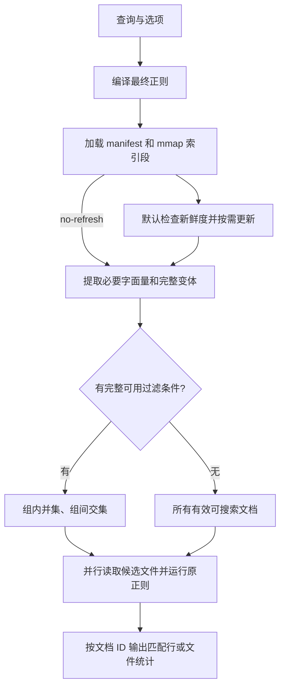

# coderg 已实现的优化与策略

本文按 2026-09-07 的当前工作区代码整理，覆盖 `src/` 中实际参与构建和搜索的实现，包括尚未提交的现有改动。源码是行为依据；实验报告用于说明测量结果。两字节查询扩展已由用户决定**暂缓采用**，不属于本文的已实现优化。

coderg 的主要收益来自三件事：提前用索引排除不可能匹配的文件；以紧凑格式按需读取索引；文件或 Git 状态变化时尽量复用已有内容索引。最终匹配仍由 Rust `regex` 引擎读取候选文件后完成。

## 1. 搜索流程与模块分工



默认搜索在索引加载失败时尝试重新构建；刷新改变索引后重新加载 manifest 和段映射。`--no-refresh` 跳过新鲜度检查，仍需加载索引，且加载失败会直接报错。[search::run](../src/search.rs#L24)

| 模块 | 主要职责 |
|---|---|
| [main.rs](../src/main.rs) | CLI 参数、搜索结果退出码、索引统计输出 |
| [ngram.rs](../src/ngram.rs) | 字节 gram 生成、稀疏选择、哈希及权重缓存 |
| [segment.rs](../src/segment.rs) | 索引段编码、内存映射、按键读取文件 ID 列表 |
| [index.rs](../src/index.rs) | 文件快照、构建/刷新、文档版本、跨段查询及树缓存 |
| [git_state.rs](../src/git_state.rs) | 进程内读取 Git 身份、工作区状态和变更路径 |
| [query.rs](../src/query.rs) | 从正则结构提取安全的索引过滤条件 |
| [search.rs](../src/search.rs) | 预算控制、候选集合运算、最终匹配和输出 |

## 2. 文件收集、编号与并行构建

文件遍历使用 `ignore::WalkBuilder::build_parallel`，遍历线程数取自 Rayon 当前线程池。遵守默认 ignore 规则，包含隐藏文件，不跟随符号链接，排除 `.git` 和实际选用的索引目录。默认索引目录为 `<root>/.coderg-index`；相对 `--index-dir` 按搜索根目录解析。[collect_files](../src/index.rs#L547)、[resolve_index_dir](../src/index.rs#L93)

每个普通文件记录相对路径、长度和纳秒修改时间，最终按路径排序。这个有序快照用于比较工作区变化；全量构建也按它分配 `u32` 文档 ID。增量修改现有文件时复用 ID，新增文件追加 ID，删除文件标记失效；全量重建会重新编号。

文件内容读取及 gram 生成使用 Rayon 并行处理。当前先 `fs::read` 整个文件，再根据前 8 KiB 是否含 NUL 判定二进制文件。二进制文件保留元数据，但 `searchable = false`，不生成 postings，也不进入正常搜索候选。[index_files](../src/index.rs#L370)

每个文件先把 gram 哈希放入集合，同一 gram 在文件内重复出现只产生一个文件关联。然后按哈希汇总文档 ID，写段前再次排序、去重。索引保存的是“哪些文件含有这个片段”，没有记录片段在文件内的位置或出现次数。[postings_from_files](../src/index.rs#L397)

## 3. 字节 gram 的生成和选择

### 3.1 所有三字节片段，加较长的稀疏片段

`MIN_GRAM = 3`、`MAX_GRAM = 24`，单位都是**字节**。每个连续三字节片段都会进入索引；长度 4–24 的片段按照内部字节对权重选择一部分。[for_each_sparse_gram](../src/ngram.rs#L68)

对于一个候选长片段，计算相邻两字节的确定性权重。仅当左右端点字节对的权重都严格大于内部字节对权重时，保留该片段。权重来自字节值的哈希混合，没有使用语料中的词频或文档频率。

选择规则只依赖片段内部的字节，因此从查询中选出的 gram，只要确实出现在某个文件中，也会由该文件的同一生成规则产生。这是查询过滤能够复用稀疏 gram 的基础。

### 3.2 长片段优先，减少查键数

`best_hash` 在一个字面量的可用 gram 中选择最长片段，只返回一个哈希键；同长度时保留后遍历到的候选。长片段通常有更好的区分能力，同时单个变体只需查一个键，但代码没有通过实际 postings 长度证明它是最稀有的片段。[best_hash](../src/ngram.rs#L54)

不足三字节的字面量返回 `None`。例如单独的 `if` 或 `\bif\b` 当前没有可用 gram；如果整个正则中另有较长的必要字面量，仍可使用那个片段过滤。

### 3.3 减少生成和哈希的重复计算

| 已实现策略 | 具体行为与收益 |
|---|---|
| 增量扩展哈希 | 对同一起点先计算三字节哈希，延长片段时只追加新字节，复用已有哈希状态 |
| 维护内部最大权重 | 延长片段时增量更新最大值，避免每次重新扫描所有内部字节对 |
| 提前结束扩展 | 内部最大权重一旦不小于左端点权重，更长片段也无法满足条件，立即结束该起点的扩展 |
| 字节对权重查表 | 输入长度达到 4,096 字节时，使用 `OnceLock` 延迟初始化的 65,536 项 `u64` 表；表数据约 512 KiB，进程内共享 |
| 小输入直接计算 | 不足 4,096 字节时直接计算权重，短查询无需为了查表初始化完整权重表 |
| 紧凑哈希键 | 将混合后的 64 位哈希高低半部异或，得到 `u32` 索引键 |
| 专用整数哈希器 | gram 集合/映射使用 `IdentityHasher`，整数键复用已计算的哈希值 |

实现见 [ngram.rs](../src/ngram.rs#L15) 和 [pair_weights](../src/ngram.rs#L104)。32 位键可能碰撞；碰撞会合并额外文件候选，最终是否匹配仍由原正则决定。

## 4. 紧凑、不可变的索引段

当前格式版本为 4。一个段包含 `.lookup` 与 `.postings` 两个文件，发布后内容保持不变；manifest 记录当前使用哪些段。[segment.rs](../src/segment.rs#L13)

### 4.1 排序、分块和压缩

| 结构 | 当前编码 |
|---|---|
| lookup 头部 | 32 字节，包含 magic、键数量、块数量和块大小 |
| lookup 分块 | 每块最多 128 个有序哈希键 |
| 块目录 | 每块 16 字节：首键 `u32`、lookup 流偏移 40 位、postings 基址 40 位、条目数 `u16` |
| 块内键 | 首键来自目录，其余键以相邻差值的 varint 编码 |
| 单文档 posting | 文件 ID 直接内联到 lookup 的 varint 描述符中，无需读取单独的 posting 数据 |
| 多文档 posting | 有序文件 ID 差分后用 varint 编码；lookup 记录编码数据长度 |
| posting 地址 | 由块基址加之前条目的编码长度推进，减少每个键单独保存完整偏移的开销 |

描述符最低位区分内联 ID 和外部 posting。写入时使用缓冲输出，并逐项从待写 postings 映射取走列表。40 位偏移字段可表示的范围小于 1 TiB，写入时会检查上限。[segment::write](../src/segment.rs#L41)

### 4.2 mmap 与局部解码

lookup 和 postings 使用只读内存映射。查询先在块目录二分定位，再顺序解码目标块内的键；遇到大于目标的键就结束。仅命中目标键时才解码对应的文件 ID 列表，单文档内联项直接返回。[Segment::postings](../src/segment.rs#L153)

加载时检查 magic、头部、块目录和边界；读取条目时继续检查偏移、varint 和整数溢出。mmap 复用文件系统页缓存，但返回的 postings 和候选集合仍会分配内存，索引读取不是全程零分配。

写入段文件和 manifest 时，先写临时文件、flush，再 rename 到目标路径；Windows 下替换已有目标前会先删除目标。构建/增量更新先发布段，再更新引用它的 manifest。[manifest 写入](../src/index.rs#L506)

## 5. 正则字面量、忽略大小写与查询预算

### 5.1 从正则结构提取必要条件

普通正则使用 `regex-syntax` 解析成 HIR。解析器配置与搜索使用的字节正则相适配，应用大小写和多行锚点选项，并允许显式的非 UTF-8 字节模式。[literal_strategies](../src/query.rs#L19)

提取策略如下：

1. 对表达式分别提取前缀和后缀字面量，因此前缀不确定时仍可能利用后缀。
2. 对拼接表达式检查连续 **3 个 HIR 节点**的窗口，并递归检查各部分；这里的三个节点不等于三个字符或三个字节。
3. 递归进入捕获组，以及最少重复次数大于零的子表达式。
4. 可选重复或单独的 alternation 分支不会被递归当成必需条件；完整表达式提取出的安全变体并集仍可使用。
5. 每个变体通过 `best_hash` 选键，随后对组内键排序、去重，并去掉重复的条件组。

没有完整可用字面量的条件会被放弃。只要一组中有替代项无法产生 gram，这一组就不能作为必要过滤条件使用。[collect_required_strategies](../src/query.rs#L32)

`-F` 且大小写敏感时，直接对固定字符串选择一个 gram，省去 HIR 提取流程。最终验证仍使用转义后的正则。`-F -i` 使用转义后的表达式走大小写变体规划。[fixed_strategy](../src/query.rs#L94)

### 5.2 忽略大小写复用原始字节索引

索引保留源文件的原始大小写。`-i` 在查询端提取 Unicode 大小写变体，将等价变体对应的文件集合取并集。拼接窗口让长标识符可以使用局部必要片段，减少一次展开整个标识符全部组合的需求。

这里没有增加一份全小写索引，也没有把 Unicode 匹配降为 ASCII 转小写。测试覆盖 ASCII 大小写组合、`ſ`、`K`、希腊 sigma、可选分支和混合的内联大小写选项。[query 测试](../src/query.rs#L144)、[CLI 测试](../tests/cli.rs#L52)

### 5.3 当前采用 128 / 128

| 参数 | 当前值 | 限制对象 |
|---|---:|---|
| `MAX_LITERAL_VARIANTS` | 128 | 每次提取时传给 `limit_class` 和 `limit_total` 的变体展开预算 |
| `MAX_INDEX_LOOKUPS` | 128 | 一条查询实际读取的不同索引哈希键数量 |
| 条件组数量上限 | 128 | 当前复用 `MAX_INDEX_LOOKUPS`，限制最多生成多少组过滤条件 |

这几个数不代表只保留前 128 个候选文件。变体数、不同哈希键数、段内读取次数、候选文件数是不同指标：一个查询键可能要读取多个段，多个变体也可能合并为同一个键。

128 / 128 是已接受并实施的配置，选择依据及实验限制见[决策记录](decisions/2026-09-07-case-insensitive-index-budget.md)。

### 5.4 组内并集、组间交集，超预算放弃整组

```text
条件 A：posting(A1) ∪ posting(A2) ∪ …
条件 B：posting(B1) ∪ posting(B2) ∪ …
候选文件：条件 A ∩ 条件 B ∩ …
```

查询期间按键缓存已解码的 postings。处理下一组前，先计算尚未缓存的新键数量；如果加入后超过 128，跳过整组，保留之前已完成的过滤结果。不能只查询一部分变体就使用那个不完整并集，否则会漏掉其余分支或大小写变体的匹配。[intersect_postings](../src/search.rs#L128)

组内并集和组间交集使用 `BTreeSet`。交集为空时立即停止后续查键；若没有任何完整条件成功应用，就扫描全部 `active && searchable` 文档。**已证明为空的候选集**会直接产生无匹配结果，不会触发全扫描。

当前按规划顺序应用条件，没有根据 postings 长度重新排序，也没有“候选占比达到某个百分比就改为全扫描”的自适应阈值。

## 6. 文档版本、增量段和 Git 状态复用

### 6.1 有效版本过滤

manifest 为每个文档保存 `active`、`searchable` 和当前 `segment_id`。读取一个键在各段的 postings 时，只接纳仍有效、可搜索、且当前版本确实属于该段的文档 ID，再合并去重。因此修改文件后，旧段即使还含有旧 gram，也不会让旧版本继续参与候选筛选。[DiskIndex::postings](../src/index.rs#L424)

### 6.2 小变更合成一个 delta

刷新先比较文件快照；可用时也利用 Git 提供的变更路径。现存文件修改复用 ID，新文件追加 ID，删除文件置为 inactive。本轮所有需要重新索引的文件并行处理后写成**一个批量 delta 段**；未变文件继续引用原段。[write_incremental](../src/index.rs#L280)

仅有删除时，没有待读取文件，可以只更新 manifest。二进制/文本属性也在重新读取后更新。旧段保留，读取时通过版本字段排除失效项。

### 6.3 同一提交的常用快路径

Git 操作使用 `git2`/libgit2，在进程内完成。`identity` 只读取 HEAD commit 和 tree；完整 `inspect` 才计算工作区 status。status 包含未跟踪文件、排除 ignored 文件和子模块，并限制在搜索根目录范围内，忽略实际索引目录。[git_state.rs](../src/git_state.rs#L25)

当索引记录的 HEAD/tree 与当前身份一致时：

- 跳过完整 Git status，直接收集文件元数据快照。
- 快照相同则返回 `Unchanged`。
- 快照变化则计算修改、新增、删除数量，选择增量或重建。

这条快路径仍会遍历文件并读取元数据。新鲜度判断主要依赖路径、长度和修改时间，没有为每次搜索重新计算全部文件内容哈希。[refresh](../src/index.rs#L163)

### 6.4 提交推进与树缓存

HEAD/tree 变化等情况下进入 Git status 路径。只有 status 路径完整、没有相关变更且仓库状态正常时，才把工作区视为干净；路径不能完整转换成 UTF-8 时，不使用不完整的变更路径集合。

| 情况 | 当前处理 | 主要省下的工作 |
|---|---|---|
| HEAD 改变，tree 不变，工作区干净 | 更新 HEAD 和 generation，缓存 manifest | 不重新读内容或生成 gram |
| 已索引的工作区修改随后提交，文件快照不变 | 更新 manifest 的 HEAD/tree 并缓存 | 已有 delta 直接沿用 |
| 工作区干净，目标 tree 有缓存 | 切换到 `manifests/<tree>.json` 指向的段集合 | 复用该树的内容索引 |
| 没有可用树缓存，工作区有小变更 | 收集当前快照，用变更路径或元数据比较选择待更新文件 | 只重算需要更新的内容 |
| 无 Git 仓库 | 按文件元数据快照比较并更新 | 同样支持小变更增量 |

缓存按 **Git tree ID** 保存，只有干净状态会生成树缓存。回退到缓存树时，`restore_cached_tree` 仍会重新收集文件元数据，更新缓存里的长度/mtime 快照，避免 checkout 改变时间戳后，下次搜索又生成不必要的 delta。[restore_cached_tree](../src/index.rs#L451)

因此，“命中树缓存”表示复用索引内容，不表示完全不遍历文件。dirty 状态的变更路径也用于减少**重读和重算内容**，代码仍会收集当前文件列表。

### 6.5 增量与重建的阈值

需要应用文件变更时，满足任一条件就全量重建：

```text
当前 manifest 引用的段数 >= 8
或
changed >= 64 且 changed × 5 > max(当前文件快照数量, 1)
```

第二个条件同时要求至少 64 个变更，且数量严格超过当前文件快照的 20%。元数据路径的变更数包含新增、修改、删除；使用 Git 变更路径时以该集合大小计数。分母是收集到的普通文件快照数量，包含被标记为不可搜索的二进制文件。[refresh 阈值](../src/index.rs#L178)

段数为 7 时仍可追加到 8；之后遇到需要应用的文件变更才重建。无变化、提交推进和可用的树缓存切换可以直接返回。

全量重建产生一个新基础段供当前 manifest 使用。旧段和树缓存文件没有自动垃圾回收，所以当前引用的段数受到控制，不等于整个索引目录的历史磁盘占用受到同样限制。

## 7. 最终匹配与输出路径

候选文件使用 Rayon 并行读取，共用编译好的 `regex::bytes::Regex`。每个文件完整读入内存，在整份字节内容上运行 `find_iter`。[search::run](../src/search.rs#L72)

每个文件先建立行起点数组，再对每个匹配的起点二分定位行号，用 `BTreeSet` 去重和排序，同一行有多个匹配时只输出一次。`-m N` 按每个文件累计的匹配行数限制后续处理。[match_file](../src/search.rs#L167)

`-l` 和 `-c` 跳过完整匹配行字符串的生成，分别输出文件名和匹配行数。当前 `-l` 没有自动在第一个匹配处结束，仍会执行行号定位与去重流程；普通模式会先收集匹配行字符串，全部候选处理完成后按文档 ID 顺序输出。新文件的 ID 在增量时追加，因此不能把输出顺序一概理解为路径字典序。

这一路径的成本随着候选文件大小、匹配次数及输出行数增加。索引有效时减少的是进入这条路径的文件，已经确认需要输出的匹配行仍要处理。

## 8. 当前边界、回退与暂缓策略

| 情况 | 当前行为或状态 |
|---|---|
| 索引不存在、版本不符或加载失败 | 默认搜索尝试构建；`--no-refresh` 直接报错。后续读取 postings 时发生的错误会传播，不保证自动修复所有损坏 |
| 无完整可用字面量，或全部条件因预算被跳过 | 扫描当前索引中所有有效、可搜索文件 |
| 已有部分完整过滤条件，后续条件超预算 | 保留已有过滤，跳过超预算整组 |
| 候选交集为空 | 不读取候选文件，返回无匹配 |
| `--no-refresh` | 使用现有索引筛选，但读取的是文件当前内容；内容变化可能使旧候选漏掉新匹配，文件删除也可能造成读取错误 |
| 元数据未反映内容变化 | 相同长度和 mtime 的内容替换可能不触发刷新；当前不是按内容哈希验证新鲜度 |
| `\s`、锚点和空匹配 | 最终正则作用于整份文件，与 rg 默认逐行搜索存在语义差异，详见下文 |
| 两字节向三字节扩展 | **已实验、暂缓采用**。用户认为候选仍多，当前正式代码未加入扩展路径、相应环境变量或额外预算 |

最近的 vLLM 校验确认两处语义差异仍存在：`async\s+def\s+\w+` 可以跨越换行并输出匹配起点所在行；`^[ \t]*$` 会额外匹配文件末尾换行后的虚拟行及空文件位置。`.multi_line(true)` 只影响锚点行为，不禁止 `\s` 跨行。它们属于最终匹配语义问题，不是哈希碰撞导致的错误。[复核证据](../benches/results/data/vllm-regex-suite-2026-09-07/parity-diagnostics.json)

两字节扩展的[实验报告](../benches/results/vllm-short-expansion-2026-09-07.md)及原型继续保留作为研究记录。该方案枚举相邻字节、取多个三字节 posting 的并集，实验收益不改变“暂缓采用”的当前决策。

## 9. 构建配置、测试与测量依据

release profile 使用 thin LTO、`codegen-units = 1` 和 strip。profiling profile 继承 release 优化，保留调试信息且不 strip，便于采样定位。这些是构建设置，没有对每个选项单独给出性能归因。[Cargo.toml](../Cargo.toml)

| 验证入口 | 当前覆盖 |
|---|---|
| `src/ngram.rs` 单测 | 查询选择的 gram 存在于匹配文档；短片段回退；增量最大值选择和查表与原算法一致 |
| `src/segment.rs` 单测 | posting varint、内联 ID、跨块 lookup 读写往返 |
| `src/query.rs` 单测 | 前后缀、分支、大小写变体、Unicode、可选/重复结构和字节模式的过滤保守性 |
| `src/search.rs` 单测 | 匹配行去重；组内并集/组间交集；重复键缓存；预算不能截断替代列表；无过滤时全扫描 |
| [tests/cli.rs](../tests/cli.rs) | 构建、更新、删除、无字面量查询、大小写查询与直接正则匹配一致 |
| [tests/git_incremental.rs](../tests/git_incremental.rs) | overlay 更新、提交推进、同树新提交、回退复用树缓存，以及回退后的继续增量 |
| [compare_rg.rs](../benches/compare_rg.rs) | 固定字符串、文件列表输出的进程级对比；生成语料时另测增量、提交推进和回退 |
| [regex_suite.py](../benches/regex_suite.py) | 常见正则的完整输出校验、默认/no-refresh/rg 随机交错计时及可选 RSS 测量 |

本次整理时执行 `cargo test --locked`，17 个单元测试、2 个 CLI 集成测试和 1 个 Git 增量集成测试全部通过。正文中的本地文件链接和源码行号已核对。

最近一次完整正则 benchmark 使用 vLLM 6,835 个文本文件、82.38 MiB，Apple M5 / 24 GiB，release、热缓存、每项 3 次预热和 31 次计时。30 个查询中 28 个输出一致；这些查询的中位数等权平均为默认 48.79 ms、no-refresh 31.79 ms、rg 71.92 ms。两项语义不一致的查询未计入性能汇总。[完整报告与原始样本](../benches/results/vllm-regex-suite-2026-09-07.md)

这是当前整条处理路径的测量，不是本文各项优化的独立消融结果。索引构建成本单独记录；`stats` 的 `index bytes` 只包含当前 manifest 和它引用的段，不包含所有历史段及树缓存文件，也不同于进程 RSS。[stats](../src/index.rs#L639)

复核常用入口：

```sh
cargo test --locked
cargo bench --bench compare_rg
```

查询预算的详细比较见[128 / 128 决策记录](decisions/2026-09-07-case-insensitive-index-budget.md)；需要完整匹配行输出及正则覆盖时使用 `benches/regex_suite.py`，具体参数见[测试报告](../benches/results/vllm-regex-suite-2026-09-07.md)。
