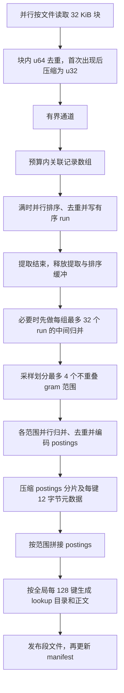

# 索引构建优化全景：从全量驻留到有界缓冲与 4 路归并

截至 2026-09-08，coderg 已将构建过程改为 **32 KiB 分块提取、256 MiB 工作缓冲预算、预算内排序与磁盘外排、最多 4 路最终归并并编码**。vLLM 最新构建耗时中位数为 **792.44 ms**，峰值 RSS 中位数为 **212.89 MiB**；四倍 vLLM 为 **2899.00 ms / 217.13 MiB**。索引继续使用版本 4 的 lookup/postings 格式。

本文依据仓库中已有设计、源码和 benchmark 整理构建流程的完整演进，覆盖原始数据结构优化及随后这轮预算、提取、分块和归并优化。查询覆盖和刷新策略的独立收益见[查询专项文档](query-covering-optimization.md)及[已实现优化](implemented-optimizations.md)。本文未新增性能实验。

## 1. “最初版本”与比较口径

历史记录中有两个应明确区分的起点：

| 比较起点 | 实现状态 | 用途与证据 |
|---|---|---|
| 最早原版，2026-09-07 | 保存所有文件的 HashSet，再构造全局 `HashMap<gram, Vec<doc_id>>`；有整文件权重数组 | 观察整条优化路线；基线提交 `18c9cc78c332c38d95d70dfade3ca50d9455f23c`，[原始内存报告](../benches/results/vllm-memory-2026-09-07.md) |
| 本轮开始前，2026-09-08 | 已改为紧凑数组、连续关联记录和共享权重表；仍保存全语料记录，无构建预算 | 评估本轮 256 MiB 预算及后续优化；基线为 `74387541f37851bd8df570b9663a507912178909` 加当时已有工作区改动，[预算对照](../benches/results/build-memory-budget-2026-09-08.md) |

本文的累计变化取历史中位数与最新中位数作算术比较，**不是重新交错运行最早版和最新版的同轮实验**。相同机器、语料和热缓存条件有利于观察趋势，但软件状态、测量轮次和样本数存在差别。后文“单轮收益”只使用对应报告内部的前后对照，各轮百分比不相加或相乘成累计加速。

各轮主要使用 Apple M5、10 个逻辑 CPU、24 GiB RAM、macOS arm64 和 release 构建。最早与预算实验各预热 1 次、计时 5 次；后续提取、32 KiB 和归并实验各预热 2 次、计时 7 次。峰值 RSS 均另测 3 次，表中的 RSS 为这些进程峰值的中位数。

## 2. 从最初版本到当前版本的成果

### 2.1 vLLM 的完整演进

语料固定为 vLLM commit `569adb5a9780f9c02d22a6b29826acf711512356`，6,835 个可搜索文件、86,384,180 bytes（82.38 MiB）。下表为不同历史轮次的观测值，按各版本当时的报告列出。

| 阶段 | 完整构建 ms | 峰值 RSS MiB | 主要改变 |
|---|---:|---:|---|
| 最早原版 | 2478 | 2082.70 | 每文件集合、全局倒排映射和权重数组同时占用大量内存 |
| 紧凑记录与直接编码 | 754 | 594.86 | 去掉长期保留的集合桶及大量独立 postings Vec |
| 再移除整文件权重数组 | 743 | 517.70 | 使用共享字节对权重表 |
| 本轮开始前重新测量 | 845.10 | 512.84 | 仍为全内存构建，作为预算实验基线 |
| 初次加入 256 MiB 预算 | 1312.78 | 208.08 | 分块、有界队列、外排及串行最终归并 |
| 当前实现 | **792.44** | **212.89** | 后置压缩、32 KiB 块、4 路归并并编码 |

前三行来自[早期内存优化](../benches/results/vllm-memory-2026-09-07.md)，中间两行来自[预算实验](../benches/results/build-memory-budget-2026-09-08.md)，最后一行来自[最终归并实验](../benches/results/parallel-merge-2026-09-08.md)。743 ms 与后来重新测得的 845 ms 不应视为单个改动的回退证据。

按历史中位数比较，最早原版到当前版本的 vLLM 峰值 RSS 减少约 **89.8%**，构建耗时减少约 **68.0%**。这描述整条构建优化路线的观测结果，不能全部归因于最后一次并行归并。

### 2.2 本轮预算优化开始前与当前版本

四倍语料把 vLLM 可搜索文件复制成四份，共 27,340 个文件、329.53 MiB，不含 Git 仓库。它用于检查规模增长后的工作集，不代表更多样的源码分布。

| 语料 | 本轮开始前 ms | 当前 ms | 耗时变化 | 开始前 RSS MiB | 当前 RSS MiB | RSS 降幅 |
|---|---:|---:|---:|---:|---:|---:|
| vLLM | 845.10 | 792.44 | **−6.2%** | 512.84 | 212.89 | **58.5%** |
| vLLM × 4 | 2741.30 | 2899.00 | **+5.8%** | 1735.53 | 217.13 | **87.5%** |

这一跨轮汇总说明，当前已在显著降低内存的同时，收回大部分初次外排带来的延迟成本。初次启用预算时，两组耗时分别增加 **55.3% / 94.6%**；从初次预算版到当前版，历史中位数分别下降 **39.6% / 45.7%**。四倍语料相对无预算基线仍有约 158 ms 的额外耗时。[初次预算原始汇总](../benches/results/data/build-memory-budget-2026-09-08/summary.json)、[当前原始汇总](../benches/results/data/parallel-merge-2026-09-08/summary.json)

源码规模从 vLLM 增至四倍时，当前 RSS 中位数仅从 212.89 增至 217.13 MiB，而无预算版本从 512.84 增至 1735.53 MiB。这是这轮改造最主要的规模收益：关联记录的工作区受预算控制，超出的部分通过磁盘处理。

## 3. 数据流和内存生命周期如何改变

| 环节 | 最早原版 | 本轮开始前 | 当前实现 |
|---|---|---|---|
| 文件读取 | 整文件读取 | 整文件读取 | 每次最多 32 KiB，保留 23 字节重叠 |
| 字节对权重 | 整文件 `Vec<u64>` | 共享查表或按需计算 | 沿用共享 512 KiB 表，小输入直接计算 |
| gram 去重 | 每文件 HashSet，长期保留 | 每文件去重后转紧凑 Vec | 每块 `HashSet<u64>`，首次出现后压缩并直接追加 `Vec<u32>` |
| 待处理结果 | 保存所有文件集合 | 保存所有文件紧凑数组 | 有界通道，生产者等待消费 |
| 全局关联表示 | `HashMap<gram, Vec<doc_id>>` | 全语料连续 `(gram, doc_id)` 数组 | 固定容量的连续数组，满时排序、去重、外排 |
| 最终排序 | 键排序及各文档列表排序 | 全量 Rayon 原地排序 | 每个 run 内排序，最终按键范围并行归并 |
| 编码 | 从全局映射生成索引 | 从全量排序记录直接编码 | 无外排走直接编码；多 run 归并时直接编码 postings 分片，再生成 lookup |
| 内存随源码增长 | 集合、映射和多个数组叠加增长 | 连续记录仍随语料增长 | 主要构建缓冲受预算约束，元数据等仍可增长 |

当前多 run 路径的数据流如下。不同文件可并行提取，同一文件的块按顺序读取；图中的 4 路只对应提取结束后的最终归并。



完全不外排时，排序后的内存数组直接进入编码器；只剩一个 run 时，利用其已知键数流式编码。这两条路径避免为小任务增加分片成本。[实现：构建缓冲与归并](../src/build.rs)、[实现：段编码](../src/segment.rs)

## 4. 各项优化的作用与独立证据

### 4.1 数据结构改造：先消除重复表示

原始流程同时保存“每文件有哪些 gram”和“每 gram 对应哪些文件”两种方向的完整结构。将集合及时转成紧凑数组，再把关联统一写为每条 8 字节的连续记录，能够释放集合桶，消除大量独立 Vec 的元数据、容量余量和堆分配。排序后相同 gram、doc_id 相邻，可直接去重并编码。

这一步在早期 vLLM 实测中将 RSS 从 2082.70 降至 594.86 MiB，耗时从 2478 降至 754 ms。之后移除整文件权重数组，RSS 进一步降至 517.70 MiB；754 → 743 ms 的差异较小，旧报告未据此声称权重表单独具有稳定加速。[原始技术说明](index-build-memory-optimization.md)

### 4.2 256 MiB 预算：用分块和外排限制工作区

内容、块内集合、通道结果和关联记录都有有限容量。记录数组满时原地排序去重、顺序写 run，再清空复用。处理完所有文件后，释放提取及排序工作区，再进入归并编码阶段。大文件和大语料都不再要求完整放进这些缓冲区。

代价来自更小范围的去重：同一文件跨块重复的 gram 会再次输出，在排序或归并时才被消除；初次实现还增加了原始 run 写读、串行堆归并及最终合并 run 的再次写读。它解释了“内存下降但耗时上升”的初始结果，不能只把额外耗时归给磁盘带宽。[预算设计](index-build-memory-budget.md)、[瓶颈测量](../benches/results/build-bottlenecks-2026-09-08.md)

### 4.3 提取路径：哈希分布、直接输出和后置压缩

第一步把内部 `u32` 哈希从直接扩展成 `u64`，改为乘以 `0x9e37_79b9_7f4a_7c15`。这让用于桶筛选的高位具有分布，不改变保存的 gram 键，也不减少压缩成 `u32` 后的键碰撞。仅改哈希分布时，vLLM 和四倍语料耗时分别减少约 5.7% / 5.8%。

第二步在去重成功时立即追加 Vec，省去块结束后的 HashSet 遍历，同时增加提取期间的 Vec 写入。独立增益较小：相对“仅改哈希”版本，vLLM / 四倍语料约减少 0.7% / 0.4%，8 MiB 组反而约增加 1.2%；两项合并的明确收益主要来自哈希分布。[三版本对照](../benches/results/gram-extraction-2026-09-08.md)

随后将压缩放到块内去重之后。当前流程为：

```text
扫描并生成已混合的 u64 gram 哈希
    → HashSet<u64> 精确去重，哈希器直接使用该 u64
    → 首次出现时 compact_hash，压缩为 u32
    → 追加到 Vec<u32>
    → 后续关联记录排序、归并去重
```

因此，当前构建集合已不再对每个候选 gram 执行 `u32 → u64` 乘法扩散，重复 gram 也不再先做压缩。`write_u32` 的扩散逻辑仍用于其他使用 `u32` 键的集合或映射，不能把它与后置压缩当成当前热路径上叠加执行的两项操作。[当前 gram 实现](../src/ngram.rs)

后置压缩单轮实测让 8 × 8 MiB 完整构建快 11.4%，vLLM / 四倍语料快 1.6% / 1.3%。块内键从 `u32` 变为 `u64`，该轮 RSS 中位数分别增加约 1.27 / 2.13 / 0.20 MiB。不同 `u64` 压缩成相同 `u32` 时可能多输出记录，随后仍被排序归并消除；实测 8 MiB 组多 1 条、vLLM 多 28 条，最终索引不变。[后置压缩报告](../benches/results/deferred-gram-compaction-2026-09-08.md)

### 4.4 16 → 32 KiB：扩大块内去重范围

较大的块让更多同文件重复 gram 在提取时消失，减少传递及排序的记录数。8 MiB 组的输出记录从 7,324,101 降至 5,953,743（−18.7%），vLLM 从 45,120,809 降至 40,961,298（−9.2%）。

该轮完整构建耗时分别下降 4.4% / 3.0% / 5.0%（8 MiB 组 / vLLM / 四倍语料）。vLLM 的 gram 生成与输出线程累计耗时基本持平，排序和排序后去重下降更明显；不能把这一收益解释为 gram 扫描本身更快。每线程 8 MiB 预留仍覆盖 32 KiB 块的集合、输出和队列峰值。[32 KiB 对照](../benches/results/chunk-32k-2026-09-08.md)

### 4.5 4 路最终归并：同时减少串行工作和原始临时写读

最后 2–32 个 run 按记录数均匀采样，选择 gram 四分位边界。每个 run 通过二分搜索定位各范围，同一个 gram 不拆开，因此一个任务能完整处理它的跨 run 去重和 posting 编码。

各任务写压缩 postings 分片，并用有界缓冲写每键 12 字节元数据：`u32 gram + u64 tagged_value`，后者表示内联文档 ID 或压缩后的 posting 长度。任务完成时已知总键数，先拼接 postings，再计算 lookup 的块目录大小和正文起点，并沿全局键流生成 lookup。保持全局每 128 键分块使分片边界不改变索引字节。

旧版“完整原始归并文件写出 → 重新读取 → 编码”的过程被省去，压缩分片和键元数据仍需写读一次。最近一次同轮 release 对照结果如下：

| 语料 | 优化前 ms | 优化后 ms | 耗时变化 | 临时总写入 MiB，前 → 后 |
|---|---:|---:|---:|---:|
| 8 × 8 MiB | 124.08 | 125.08 | +0.8%，基本持平 | 0 → 0 |
| vLLM | 1127.85 | 792.44 | **−29.7%** | 540.96 → 395.37（−26.9%） |
| vLLM × 4 | 4494.66 | 2899.00 | **−35.5%** | 2165.97 → 1355.43（−37.4%） |

临时写入统计包含原始 run、压缩 postings 分片和键元数据，排除最终索引；两组真实语料初始 run 数仍为 2 / 7。不能将这一步的临时写入下降理解为相对最初无外排版本也减少了磁盘写入。8 MiB 组总量为 64 MiB / 527,380 行，未触发外排，也没有进入本轮修改的归并路径。

对应隔离插桩结果如下，单位 ms：

| 阶段 | vLLM 旧 → 新 | vLLM × 4 旧 → 新 |
|---|---:|---:|
| 提取与收集 | 437.90 → 433.70 | 2172.61 → 2150.61 |
| 排序 | 155.81 → 154.56 | 656.20 → 650.77 |
| 排序后去重 | 38.28 → 38.75 | 161.85 → 162.33 |
| 归并与编码合计 | **500.68 → 185.86** | **2123.70 → 604.52** |

归并与编码合计下降约 62.9% / 71.5%。新版 vLLM 其中约 2.83 ms 用于分区、101.25 ms 用于并行归并编码、5.45 ms 用于 postings 拼接、77.10 ms 用于 lookup。合计先对每次构建求和再取中位数，不必等于各项中位数之和。提取、排序等部分计时嵌套，不能把整表相加；线程累计时间也不是用户等待时间。

这一轮融合编码和并行同时落地，未测量两者各自的独立贡献。完整延迟和 RSS 结论取无插桩 release 结果。[4 路归并报告与原始数据](../benches/results/parallel-merge-2026-09-08.md)

## 5. 当前线程、内存和兼容性边界

**256 MiB 是构建主要工作缓冲区预算，参数名为 `--build-memory-mib`，不是进程 RSS 硬上限。** 文件元数据、manifest、Git 内部状态、线程栈、分配器保留页和 mmap 驻留页不受此参数直接限制。

在本机 10 个逻辑 CPU、文件数充足时，预算对应 8 个提取生产线程，每个预留 8 MiB，另有 4 MiB 固定预留，剩下 188 MiB 为关联记录数组。提取和 Rayon 排序可重叠，通过有界队列控制待消费结果。目录遍历还有其临时线程，整个进程没有统一限制成 4 个线程。

最终归并复用 Rayon 池，最多 4 个任务。每个任务最多读取 32 个 run，各 64 KiB 缓冲；读缓冲最坏共 8 MiB，加编码缓冲等主要工作区低于 9 MiB。此时提取、队列和排序数组已释放，可复用其预算，仍支持最低 16 MiB 配置。只有一个重 gram 或线程池不足 4 线程时，实际并发会降低。单个大文件的提取仍按块顺序执行。

当前所有 RSS 测量中最高值为 217.97 MiB。这只能证明已测语料的峰值表现，不表示任意文件数量和运行环境下 RSS 都不超过 256 MiB。[预算边界及失败清理](index-build-memory-budget.md)

未采用的方向也应与正式实现区分：4–6 个提取/排序工作线程及共用池原型未替换当前调度，相关实验仍有延迟增加；Bloom filter、小型精确缓存和集合复用没有在本轮落地。[线程实验](../benches/results/build-thread-count-2026-09-08.md)

段格式继续保留单文档内联 ID、差分 varint、每 128 键分块和 40 位偏移。跨块的 23 字节重叠覆盖最长 24 字节 gram，重复最终按 `(gram, doc_id)` 去除。段文件在临时目录完成后发布，再更新 manifest；正常返回和错误返回都清理本次临时目录。

## 6. 验证记录与后续使用

最近一次代码变更已通过 52 项测试、`cargo fmt --check` 和严格 Clippy 检查。测试覆盖跨块 gram、16 MiB 强制外排、超过 32 个 run 的中间归并、4 个分区和不可拆分重键、未对齐 lookup 块的分区边界、超长 posting、失败清理及增量刷新。

该轮 72 次 release 构建和 54 次插桩构建共 **126 次**通过 lookup/postings 完整文件哈希与文档元数据一致性检查，**30 次查询**完整输出和退出码一致。各历史阶段还有对应版本的独立等价性验证；不能把这些记录改写成“本次重新直接比较了最早版和最新版”。[最新版本与验证清单](../benches/results/data/parallel-merge-2026-09-08/manifest.json)

本文用于解释当前构建架构及累计成果；具体配置和内存口径以[工作预算文档](index-build-memory-budget.md)为准，单项收益以其同轮 benchmark 为准。若要进一步量化最早版本到当前版本的严格端到端差值，应使用归档源码/二进制在同一轮重新交错测量；现有文档已足以确认主要工作区显著缩小，以及最近并行归并的延迟收益。
