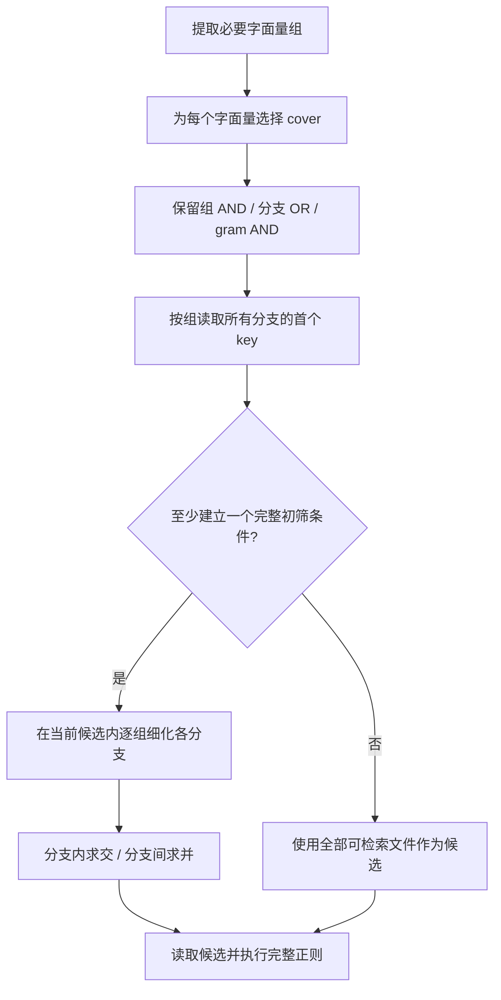

# 减少误候选与无效查表：coderg 查询覆盖与分支执行优化

coderg 先用倒排索引筛选候选文件，再读取候选执行完整正则。当前优化为字面量选择多个覆盖片段，保留各个可选分支内部的求交关系，并根据已缓存的 postings 和当前候选停止无效查表。相对上一版 16 / 16 提取策略，原有 102 项查询的耗时中位数总和从 3274.51 ms 降到 3107.12 ms，减少 5.11%；`--no-refresh` 减少 6.89%。

本文描述 2026-09-08 已实现的行为。索引格式、字节对权重和索引侧 gram 生成规则沿用原实现，现有索引可直接使用。未知 key 的成本预测暂缓，不属于本轮实现。行为摘要见[查询覆盖说明](query-covering.md)，完整数据见[分支覆盖 benchmark](https://github.com/b1indsight/coderg/blob/5ca67a2470ac9e9e3b7cc08ad3f2b8115f68a170/benches/results/branch-covering-2026-09-08.md)。

## 1. 片段数量不能代表过滤强度

每个索引 key 是一个字节片段的 hash，对应包含该片段的文件列表。一个字面量可能需要多个 key，不同字面量也可能共享 key。查询实际查表数按不同 hash 去重，并受到预算和提前停止的影响。

只选一个最长 gram 时，文件只要包含该片段就可能进入候选。覆盖字面量的更多位置，可以约束原来没有参与过滤的部分，但新增列表的解码与集合运算也有成本。

即使选中了相同的 key，分支组合方式仍会影响候选。如果两个可选字面量分别要求 A、B 与 C、D，完整分支条件是：

```text
(A 且 B) 或 (C 且 D)
```

上一版为了适配平面的“组内并集、组间交集”，按覆盖片段的序号组合成 `(A 或 C) 且 (B 或 D)`。它保留真实匹配，但只有 A、D 的文件也能进入候选。本轮保留分支关系：`tensor_creation` 同样查询 14 个 key，候选从 2096 降到 1211，默认搜索耗时下降 15.4%。

## 2. 从已有索引片段构造 cover

索引包含全部三字节片段，以及长度为 4–24 字节、满足稀疏规则的片段。每个相邻字节对使用确定性的权重：

```text
value  = 第一个字节 | (第二个字节 << 8)
weight = mix(value XOR 0x9e3779b97f4a7c15)
```

`mix` 是 64 位整数混合函数。对于超过三字节的片段，首尾字节对的权重必须都严格大于所有内部字节对。这个判定只依赖片段内部的字节，因此查询选中的 gram 也会被包含该字面量的文档建入索引。权重不是语料频率，不表示片段的罕见程度。

`covering_grams` 在这些可用片段上选择覆盖：

1. 记录每个起点的最长可用 gram。
2. 保留整条字面量中最长的 gram；长度相同时选择更靠后的起点。
3. 从左向右补齐覆盖，每次选择能够延伸最远的片段；相邻片段至少重叠两字节，以覆盖每个三字节窗口。
4. 按长度、起点降序排列选中片段，将 hash 去重，最多保留 128 个不同 key。

这里的“覆盖”约束片段出现的位置范围，不证明候选文件中的片段相邻。文档索引只记录文件 ID，最终仍由完整正则检查位置和顺序。超长字面量受 key 上限约束时只保留部分覆盖，过滤会放宽。

实现见 [ngram.rs](../src/ngram.rs) 中的 `for_each_sparse_gram`、`covering_grams` 和 `covering_hashes`。当前 cover 的生成仍按长度与位置选择；后面的缓存排序不改变索引中有哪些 gram。

## 3. 分开限制字符类和跨位置组合

字符类展开数量、字面量组合数量和实际 key 数属于不同阶段，当前分别限制：

| 参数或限制 | 当前值 | 作用 |
|---|---:|---|
| `MAX_INITIAL_CLASS_VARIANTS` | 16 | 第一遍单个字符类的取值数量上限 |
| `MAX_LITERAL_VARIANTS` | 128 | 两遍提取都使用的字面量组合上限；也是字符类回退上限 |
| 必要字面量组数量 | 128 | 限制收集的条件组数量 |
| `MAX_INDEX_LOOKUPS` | 128 | 整条查询实际读取的不同 key 数量 |

第一遍使用 `limit_class(16)`、`limit_total(128)`；只有整条查询没有完整可用字面量组时，才用 `128 / 128` 重试。提取器可以在展开过多时缩短必要字面量，但不能截断可选分支。任一变体不足三字节时，整组不能作为可用索引过滤条件。

必要字面量来自前缀、后缀、拼接表达式的连续三个 HIR 节点窗口，以及必要子表达式。可选重复、单独的可选分支不会被递归当成必需条件。`-F` 且大小写敏感时直接为固定字符串生成 cover，省去 HIR 提取。

例如 `["'](?:cuda|cpu|rocm)["']` 包含 2 × 3 × 2 = 12 种字面量组合。两端引号独立取值，正则也允许混合引号。单个引号字符类可以展开，全部组合一起保留。

此前同时将两个上限降到 16，会让多个小字符类的组合过早缩短。当前保留单字符类的限制，同时恢复 128 的整体组合预算。实现见 [query.rs](../src/query.rs) 中的 `required_literal_groups` 和 `extract_literals`。

## 4. 保留组、分支、gram 三层关系

当前计划类型为 `Vec<GramGroup>`，其中 `GramGroup = Vec<Vec<GramHash>>`：

```text
查询计划：必要组一 AND 必要组二 AND …
必要组：  字面量分支一 OR 字面量分支二 OR …
字面量分支：gram 一 AND gram 二 AND …
```

各必要组独立保存，无须展开跨组的笛卡尔积。在查表预算允许时，保留每个已选 cover 的完整分支内条件，不再按序号混合不同分支的片段。

去重分两层。字面量提取阶段沿用已有的包含检查：只有较强组的每个分支都包含较弱组的某个字面量，才删除较弱组。选键之后，再检查同一个 OR 内的实际 key 集合；例如 `(A 且 B) 或 A` 中，较严的前一个分支不增加候选，可以删除。

后一种简化针对实际索引条件。前一种字面量层面的包含关系，经过有限预算和选键后不一定仍保持过滤强度，因此仍是当前策略的一项取舍。实现见 `push_literal_group` 和 `push_strategy`。

## 5. 先建立完整初筛，再细化分支

如果按分支顺序把第一个分支全部查完，可能在其他分支尚未获得任何条件时耗尽预算。因此执行分为两个阶段：



第一阶段按组建立初筛。每个分支使用 cover 的首个 key，即选中的最长片段；分支首键对应的文件列表求并，再与其他必要组求交。只有全部分支的首键都能放入剩余预算时，才应用这一组。重复 key 从查询缓存复用；候选一旦为空，立即返回空结果。

第二阶段只细化已建立初筛的组。每个分支的首键文件列表与当前候选相交，再应用该分支的其他 gram；各分支的结果求并，成为这一组细化后的候选。已经只含单 key 分支的组，无须重复细化。

## 6. 用已知列表和候选跳过无效工作

进入一组的细化阶段时，根据当时的缓存状态，为分支排序：先处理需要新增 key 更少的分支；数量相同时，先处理首个 posting 文件数更少的分支。

处理某个分支时，将其后续 key 分成已缓存和未读取两部分。先应用已缓存的列表，按实际文件数升序处理；未读取的 key 继续沿用 cover 顺序。分支候选通过对已排序 postings 的二分查找保留，组内接纳集合和全局候选使用 `BTreeSet`。

以下情况可以确定性地省去后续工作：

- 文件已被本组的另一个 OR 分支接纳，无须再通过当前分支证明一次。
- 一个分支的剩余候选为空，后续 AND 条件不能重新增加文件。
- 本组已接纳全部当前候选，其他分支不能改变该组的结果。
- 全局候选为空，后续必要组不能重新增加文件。

这些停止条件不依赖“候选占比低于某个阈值”之类的预测。未知 key 尚未解码，当前不会为估算其成本额外读取 lookup 元数据。

预算耗尽时，两阶段采用不同的保守回退：

| 阶段 | 放不下新 key 时的处理 | 原因 |
|---|---|---|
| 初筛 | 跳过整组 | 部分 OR 分支的并集不完整，可能漏匹配 |
| 分支细化 | 放弃尚未读取的 AND 项，保留已有候选 | 少一个必要条件只会放宽这个分支 |

预算不足不能直接删除 OR 分支。没有完整初筛条件时全扫描；已经证明为空的候选不会回退成全扫描。实现见 [search.rs](../src/search.rs) 中的 `intersect_postings`。

## 7. 用装饰器与大小写变体检查实际 cover

装饰器测试查询为：

```regex
^[ \t]*@(?:torch|pytest)\.[A-Za-z_]+
```

名称字符类有 26 + 26 + 1 = 53 种取值，超过初始单字符类上限。提取停在 `@torch.` 和 `@pytest.`；如果继续展开名称的第一个字符，会产生 2 × 53 = 106 个前缀，当前不进行这一步。

按现有权重规则，两个字面量的 cover 为：

| 字面量 | 选中 gram | 分支条件 |
|---|---|---|
| `@torch.` | `@torch`、`ch.` | 同一文件包含两个片段 |
| `@pytest.` | `@pytest.` | 文件包含这个片段 |

`@torch` 覆盖开头六个字节，`ch.` 补上末尾，与前一个片段重叠 `ch`。完整 `@torch.` 不满足稀疏规则，因为右端字节对 `h.` 的权重低于内部的 `ch`。完整 `@pytest.` 满足规则，因此一个 gram 即可覆盖。

该查询的最终索引条件是 `(包含 @torch 且包含 ch.) 或包含 @pytest.`，benchmark 实际读取 3 个 key，留下 1348 个候选。行首、空白、名称字符以及片段是否连续，由完整正则验证。

大小写匹配仍复用原始字节索引。以 `-i 'class[ \t]+\w*Attention\b'` 中的 `class` 为例，下面只列三个字面量变体的 cover，完整查询还有其他大小写变体及 `Attention` 相关条件：

| 变体 | 字节对权重，从高到低 | cover |
|---|---|---|
| `class` | `as > cl > la > ss` | `clas`、`ass` |
| `CLASS` | `SS > AS > LA > CL` | `ASS`、`LAS`、`CLA` |
| `Class` | `as > la > ss > Cl` | `ass`、`las`、`Cla` |

`CLASS` 的四个字节对碰巧具有递增的哈希权重，不是全大写的一般规律。大小写改变原始字节，也可能改变 gram 的切分位置、长度和数量；共享的实际 key 仍只读取一次。

## 8. 同时观察候选数、候选字节和完整延迟

`quoted_device` 的候选从 677 降到 667，只减少 10 个文件，但候选字节从 20,671,769 降到 13,025,959，减少约 37%。在同一 vLLM 快照上，完整正则实际命中 651 个文件，优化前后误候选分别为 26 和 16；过滤再精确，也不能排除这 651 个真实匹配文件。

被排除的 10 个文件合计 7,645,810 字节，所以文件数变化小仍可能节省明显的读取和匹配工作。该查询默认延迟从 32.09 降到 30.77 ms，减少 4.1%；no-refresh 从 17.20 降到 15.56 ms，减少 9.6%。

完整性能矩阵使用 3 个真实仓库、4 组合成规模语料和额外共享片段语料，共 110 项查询。每项预热 3 轮，随机交错计时 21 轮，使用未插桩 release 二进制、热缓存和新 CLI 进程。新旧版本共用同一索引，输出校验在计时外进行。

| 场景 | 默认耗时变化 | no-refresh 变化 |
|---|---:|---:|
| vLLM，38 项查询 | −2.28% | −2.98% |
| viberwhisper，16 项查询 | +0.77% | +0.22% |
| agentflow，16 项查询 | −0.34% | −0.66% |
| 4096 文件语料，8 项查询 | −8.18% | −11.20% |
| 16384 文件语料，8 项查询 | −12.00% | −15.01% |
| 原有 102 项矩阵 | −5.11% | −6.89% |

表格比较各查询中位数之和，不代表一次搜索耗时，也不表示每个查询都获得相同比例的加速。`tensor_creation` 默认延迟下降 15.4%，`wide_icase_class_attention` 下降 15.3%，装饰器基本持平；`icase_literal` 增加 3.3%。

本轮同时恢复了组合预算并修改分支处理，因此另建了只恢复 `limit_total(128)` 的对照。相对这个对照，最终版本在 vLLM 38 项查询中有 19 项候选减少、19 项不变、0 项增加。`wide_icase_class_attention` 的候选变化为 1851 → 1105 → 942，分别对应 16 / 16 基线、仅恢复预算、最终版本。这个单轮诊断对照只用于解释确定性计数，不用于推断耗时收益。

诊断字段也需要区分：`keys` 是实际读取的不同 key 数；`decoded_ids` 是 `DiskIndex::postings` 返回的有效 ID 数，不包括多段场景下已被版本过滤的旧 ID，也不代表压缩字节读取量。`filter_ns` 包含集合与缓存管理，插桩时间不能代替完整 CLI 延迟。原始样本及对照见[benchmark 报告](https://github.com/b1indsight/coderg/blob/5ca67a2470ac9e9e3b7cc08ad3f2b8115f68a170/benches/results/branch-covering-2026-09-08.md)。

## 9. 正确性、兼容性与适用边界

覆盖选择只使用索引保证存在的 gram。任一真实匹配满足所属字面量分支内的必要条件；分支之间求并，独立必要组之间求交。安全停止仅跳过已无必要的求值，预算回退只放宽条件。

当前验证包括 33 个单元测试、3 个 CLI 测试、1 个 Git 增量测试。测试覆盖四个 key 的全部 16 种出现组合、不同长度与可选分支、Unicode 大小写、预算耗尽及安全提前停止。clippy、格式与 diff 检查通过。完整矩阵 110/110 项新旧输出一致，8 组语料的新旧索引段字节一致；108 项与 rg 一致，另外两项保留基线的跨行匹配与文件末尾空行语义差异。

当前索引仍为版本 4，无须因本轮查询优化重建。内存与时间仍受已解码 postings 的规模影响；字面量层面的包含剔除、有限 key 预算和处理顺序也会影响过滤强度。恢复更大的组合预算不保证每项查询都变好，`icase_literal` 仍是需要保留在回归矩阵中的例子。

未知 key 的解码前成本预测暂缓。当前只利用已经读取的 posting 文件数排序，没有增加元数据探测、预期收益模型或预测性的停止阈值。语料频率权重同样尚未实现，现有哈希权重和按长度、位置选 cover 的规则继续使用。

## 实现与证据

- [ngram.rs](../src/ngram.rs)：稀疏 gram、确定性权重与覆盖选择。
- [query.rs](../src/query.rs)：字面量提取、独立预算和三层查询计划。
- [search.rs](../src/search.rs)：完整初筛、分支细化、缓存与安全停止。
- [覆盖行为摘要](query-covering.md)：当前规则与测试入口。
- [分支覆盖 benchmark](https://github.com/b1indsight/coderg/blob/5ca67a2470ac9e9e3b7cc08ad3f2b8115f68a170/benches/results/branch-covering-2026-09-08.md)：完整延迟、诊断、单独预算对照和复现命令。
- [原始逐项汇总](https://github.com/b1indsight/coderg/blob/5ca67a2470ac9e9e3b7cc08ad3f2b8115f68a170/benches/results/data/branch-covering-2026-09-08/per-query.csv)、[机器与源码信息](https://github.com/b1indsight/coderg/blob/5ca67a2470ac9e9e3b7cc08ad3f2b8115f68a170/benches/results/data/branch-covering-2026-09-08/metadata.json)、[证据校验表](https://github.com/b1indsight/coderg/blob/5ca67a2470ac9e9e3b7cc08ad3f2b8115f68a170/benches/results/data/branch-covering-2026-09-08/manifest.json)。
