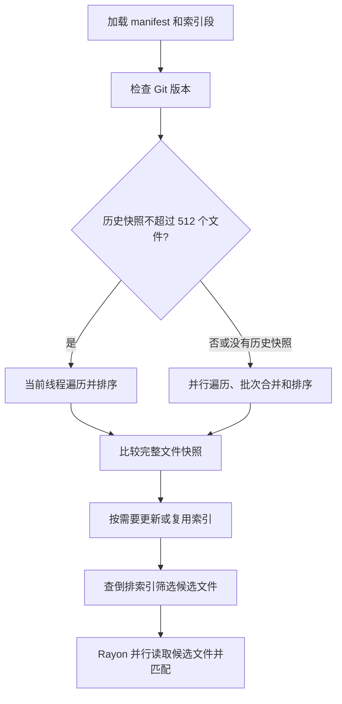

# 降低每次搜索的刷新成本：coderg 文件遍历与索引加载优化

> 本文保留 2026-09-07 的遍历与 JSON 解析优化过程和当时的测量口径。
> 截至 2026-09-10，活动 manifest 已改为二进制，Git 树缓存与 status 路径已移除，
> 更新按 32 MiB / 8 MiB / 25% 规则维护。当前行为见[最终更新设计](generational-index-refresh.md)，
> 最新性能见[三档真实提交测试](../benches/results/size-tiers-2026-09-10.md)。


coderg 用索引跳过不可能匹配的文件，但默认搜索仍要检查工作区是否发生变化。这轮先减少大仓库文件收集和 manifest 加载的开销，再根据历史快照大小选择遍历方式。小仓库策略启用后，viberwhisper 的默认搜索平均耗时从 8.30 ms 降到 6.40 ms，agentflow 从 8.56 ms 降到 6.42 ms，分别减少 22.8% 和 25.0%。

优化保留了完整文件检查、原有 ignore 规则和索引格式。关键在于减少逐文件同步、缩短解析路径，并让遍历线程数适合当前工作量。

## 1. 索引省下内容扫描，刷新仍需发现文件变化

默认搜索先加载 manifest 和索引段，再检查工作区。当前只读取 Git HEAD/tree 身份，不调用 Git status；随后完整枚举目录、读取文件元数据，并与已索引的有效快照比较。

只检查已知文件会漏掉新增文件；只检查目录修改时间也不能发现已有文件的原地内容修改。当前工具没有持续记录文件事件，因此每次搜索仍通过完整遍历发现变化。

这使小仓库面临一个实际问题：热缓存下，rg 扫描少量源码的成本已经很低，索引过滤省下的时间容易被刷新开销抵消。

最终实现的刷新路径是：



图中只展示仍保留的遍历选择；当前提交推进、回退 diff、写锁重检以及按大小维护的分支，见[已实现的优化与策略](implemented-optimizations.md)。Git 树缓存不再切换。

## 2. 将逐文件加锁改为逐线程发布批次

原来的并行遍历每发现一个文件，就要加锁写入共享列表。随着文件数增加，元数据读取之外还会产生大量锁竞争。

现在每个 visitor 持有一个 `FileCollector`，先把文件快照写入自己的 `Vec`，退出时才获取一次锁，将整批结果交给调用线程。设普通文件数为 N、遍历 visitor 数为 T，共享结果锁的获取次数从随 N 增长，降为随 T 增长。

批次保存的是 `Result<Vec<FileState>>`。遇到遍历或元数据错误时，visitor 请求停止，并将错误随批次交回。调用线程先检查所有批次的结果，成功后再合并，避免把不完整快照用于刷新。

合并前已经知道各批次长度，因此可以一次预分配目标数组。大仓库使用 Rayon 按路径并行排序，替代原来的串行排序。文件路径唯一，不需要保留相同键的输入顺序，因而可以使用不稳定排序；路径比较规则保持一致。

实现见 [FileCollector](../src/index.rs) 和 [collect_files](../src/index.rs)。

## 3. 先读入 manifest，再从字节切片解析

manifest 包含文件路径、大小、修改时间、文档状态及索引段信息，每次新进程搜索都需要加载。原来使用：

```rust
serde_json::from_reader(BufReader::new(File::open(path)?))
```

当时改为（目前只用于旧 JSON 兼容路径）：

```rust
serde_json::from_slice(&fs::read(path)?)
```

切片解析减少了 reader 适配器在解析过程中的逐字节处理开销。解析完成后，临时 JSON 字节缓冲区释放，后续遍历使用反序列化后的 manifest。

代价是解析时多保留一份原始 JSON。第一阶段广泛 benchmark 中，vLLM 默认搜索的峰值 RSS 汇总从 23.48 MiB 增至 26.06 MiB；16,384 文件语料从 16.74 MiB 增至 22.26 MiB。这是批次收集、排序和解析组合改动后的进程级实测，不能全部归因于 JSON 缓冲区。

`--no-refresh` 也需要加载 manifest，因此同样能从解析改动中受益。当前默认路径已改为 [manifest 二进制解码](manifest-format.md)，历史数据见[第一阶段广泛 benchmark](../benches/results/refresh-matrix-2026-09-07.md)。

## 4. 用分阶段计时确定小仓库的主要成本

完成批次收集和解析优化后，小仓库仍与 rg 接近。为进一步定位，在临时源码副本中插入 `Instant` 计时，对 viberwhisper 搜索 `^impl`，热缓存下重复运行 51 次，每次启动新进程。

这次搜索检查 129 个文件元数据，其中有 123 个可检索文本文件；倒排索引筛出 75 个候选文件。启用小仓库串行策略之前，内部计时中位数如下：

| 阶段 | 耗时 ms |
|---|---:|
| 参数解析与正则编译 | 约 0.08 |
| 索引加载 | 0.12 |
| Git 版本检查 | 0.51 |
| 遍历器准备 | 0.075 |
| 目录遍历、元数据读取和线程同步 | **2.81** |
| 合并、排序和比较快照 | 约 0.038 |
| 查询规划与倒排查询 | 约 0.012 |
| 读取候选文件并匹配 | 0.67 |
| 输出 | 0.067 |

遍历阶段包含 ignore 规则处理、工作线程创建与同步，不能解释为纯 `stat` 调用耗时。程序内部总耗时中位数约 4.40 ms，而无插桩版本的完整进程耗时约 7.10 ms；两种计时口径不同，不能把差额全部称为启动时间。

插桩结果用于定位阶段，正式性能对照使用无插桩二进制。完整样本、插桩开销及可展开的墙钟时间线见[小仓库搜索分阶段计时](../benches/results/small-repo-profile-2026-09-07.md)。

## 5. 分开选择遍历与匹配的并行程度

原来遍历线程数直接取自 Rayon 当前线程池。调整 `RAYON_NUM_THREADS` 会同时影响遍历和候选匹配，无法单独控制两者。

诊断实验中，使用一个线程时，遍历阶段从 2.78 ms 降到 0.73 ms，但读取候选文件并匹配从 0.68 ms 增至 1.22 ms。小仓库遍历不需要很多线程，候选匹配仍能从并行中受益。

当前锁定的 `ignore 0.4.33` 会为每次并行遍历创建并等待工作线程；工作线程等待任务或退出消息时，还有 1 ms 的休眠逻辑。线程数实验与这段实现共同提示了调度和收尾成本，但没有单独记录休眠次数，不能把全部差额归因于这一处休眠。

最终只调整文件快照收集：小仓库使用 `WalkBuilder::build` 在调用线程遍历并排序，候选文件匹配继续使用 Rayon。这样无需修改全局线程池，也无需为小仓库另外创建一个遍历线程。

## 6. 用历史快照作提示，保守选择 512 文件阈值

首次枚举之前不知道当前文件数，但 manifest 已保存上次的完整快照。普通刷新和身份变化后的刷新都可提供上次快照文件数；当前不再从历史 Git tree 缓存取得该提示。

为校准阈值，直接测量 `collect_files`，比较串行、单工作线程和默认并行遍历。每种组合预热 5 次、随机交错计时 51 次，下表摘录串行与默认并行的中位数：

| 语料 | 元数据文件数 | 串行 ms | 默认并行 ms |
|---|---:|---:|---:|
| viberwhisper | 129 | 0.965 | 2.944 |
| 合成目录 | 512 | 1.439 | 3.045 |
| 合成目录 | 1,024 | 2.505 | 3.659 |
| 合成目录 | 2,048 | 4.708 | 5.779 |
| 合成目录 | 4,096 | 9.187 | 7.322 |
| vLLM | 6,929 | 31.371 | 13.620 |

串行在较小语料上有明确收益，到 4,096 文件时默认并行更快。考虑目录结构差异，当前采用保守的 **512 文件**阈值；它是这组测量支持的实现选择，不是所有平台和目录结构的通用最优值。

历史计数包含二进制文件等元数据条目，只用于选择执行方式和初始数组容量。即使上次为空、这次新增了数百或数千个文件，串行路径也会一直遍历到结束。下一次刷新使用更新后的快照大小。

没有历史快照的首次构建继续使用并行遍历。阈值不会改变哪些文件被检查，也不会决定哪些修改需要重新索引。

## 7. 分开比较两阶段优化，并复测完整搜索

第一阶段同时修改批次收集、排序和 manifest 解析。在 36 项与 rg 输出一致的 vLLM 查询中，默认搜索中位数的平均从 47.94 ms 降到 43.18 ms，减少 9.9%；两个小型真实仓库基本持平。三项改动没有分别做正式消融，因此不将全部收益归于文件遍历。

第二阶段以第一阶段完成后的版本为基线，只加入小仓库遍历策略。七组语料、102 项查询、五种执行模式各预热 3 次、计时 21 次，共 10,710 次计时。下表只汇总与 rg 输出一致的查询，数值为各查询中位数的等权平均，单位 ms：

| 语料 | 策略调整前 | 当前版本 | rg | 当前版本快于 rg |
|---|---:|---:|---:|---:|
| viberwhisper | 8.30 | **6.40** | 7.56 | 16/16 |
| agentflow | 8.56 | **6.42** | 8.50 | 15/16 |
| 256 文件 / 4 MiB | 8.81 | **6.77** | 8.30 | 8/8 |
| vLLM | 43.86 | **44.04** | 71.86 | 33/36 |
| 4,096 文件 / 64 MiB | 30.42 | **30.69** | 46.83 | 7/8 |
| 16,384 文件 / 64 MiB | 107.38 | **106.01** | 184.21 | 7/8 |
| 64 文件 / 64 MiB | 12.52 | 10.34 | **8.85** | 4/8 |

100 项可对齐查询中，当前版本有 90 项中位数低于 rg。三个大仓库的汇总变化区间均覆盖零；对初测增长最大的三条查询另做 101 次复测，也没有稳定复现回退。`--no-refresh` 基本持平，符合本阶段仅改变刷新遍历的范围。

这些结果来自同一台 Apple M5、热文件系统缓存和已经建立的索引，每次搜索启动新 CLI 进程，首次建索引成本另计。不同阶段的执行环境和查询组合并不完全相同，因此不跨轮次相减计算组合收益。第二阶段没有重新采样 RSS。

## 8. 正确性、兼容性与适用边界

串行和并行路径共用隐藏文件、ignore、符号链接和索引目录排除配置，按相同的路径比较规则生成快照。索引格式保持版本 4，已有索引可直接使用，搜索匹配与输出逻辑没有改变。

当时验证覆盖（树缓存项属于旧版行为）：

- 串行与并行的完整快照相等；历史计数为零时仍能发现 600 个新增文件。
- 隐藏文件、忽略规则、自定义索引目录、符号链接和遍历错误。
- 新增、修改、删除、重命名、忽略规则变化，以及无变化时不改写 manifest。
- 文件数跨越阈值后再缩小、无效 ignore 规则及恢复后的两版输出和刷新诊断一致。
- Git overlay 更新、提交推进、缓存树回退及后续刷新。

该轮 23 项 Rust 测试通过；102 项查询的两版默认与 no-refresh 输出全部一致，其中 100 项也与 rg 一致。vLLM 的 `async_def` 和 `blank_lines` 保留既有语义差异，未纳入 rg 性能汇总。七组语料的首次构建段文件哈希在两版之间一致。

这轮降低了完整检查的常数成本。文件元数据检查仍随文件数增长，路径排序另有成本；新鲜度判断仍依赖路径、大小和修改时间。若要免去每次完整遍历，需要另外设计可靠的文件事件记录和恢复机制。

少量大文件的查询仍可能慢于 rg，尤其是大量命中的文件列表查询；当前匹配函数仍完整读取候选文件并收集匹配行。这属于候选匹配阶段，不能靠调整遍历线程消除。

## 实现与证据

- [文件收集、刷新和 manifest 加载实现](../src/index.rs)
- [CLI 刷新回归测试](../tests/cli.rs)、[Git 增量集成测试](../tests/git_incremental.rs)
- [第一阶段 vLLM 查询与 Git 状态转换](../benches/results/vllm-refresh-2026-09-07.md)
- [第一阶段七组语料 benchmark 与内存数据](../benches/results/refresh-matrix-2026-09-07.md)
- [小仓库分阶段计时与交互时间线](../benches/results/small-repo-profile-2026-09-07.md)
- [小仓库线程策略、阈值校准及完整复测](../benches/results/small-repo-threads-2026-09-07.md)
- [当前版本逐查询 CSV](../benches/results/data/small-repo-threads-2026-09-07/per-query.csv)
